[Back to index](https://pedroysb.github.io/Privacy-by-Evidence)

# Case Study I: Smart Metering

In this section, we present the first case study, a smart metering application which uses information regarding energy consumption. Although the main objective is to validate the <em>PbE</em>, we believe that the results presented in this section are of importance for the smart metering area. These results were to be applied in the LiteMe<a href="#fn1" class="footnoteRef" id="fnref1">1</a> application, a project developed by the Smartiks<a href="#fn2" class="footnoteRef" id="fnref2">2</a> company in partnership with the <em>Federal University of Campina Grande</em> (<em>UFCG</em>).

<h2 id="context-and-data-formats">Context and Data Formats</h2>

Smart Grids are systems that combine the traditional power grid with modern information technologies to enable a more efficient and robust grid. With these systems, power providers can monitor, analyze and control the network and communicate with the consumers to improve the energy quality, reduce energy consumption and cost, and maximize the transparency and reliability of the energy supply chain. In this scenario, a key component on the consumers’ side is the use of smart meters.

Smart meters are devices that measure electricity consumption in real time and transmit this data to remote servers. These devices may represent a turning point in the energy industry and foster the development of new services and improvement of existing ones. In a typical smart metering architecture, the analysis of the collected data can help power providers to learn how to better manage the areas within their networks. Thus, helping to understand the business benefits of investing in Smart Grids. Figure 6 presents a smart metering system architecture.

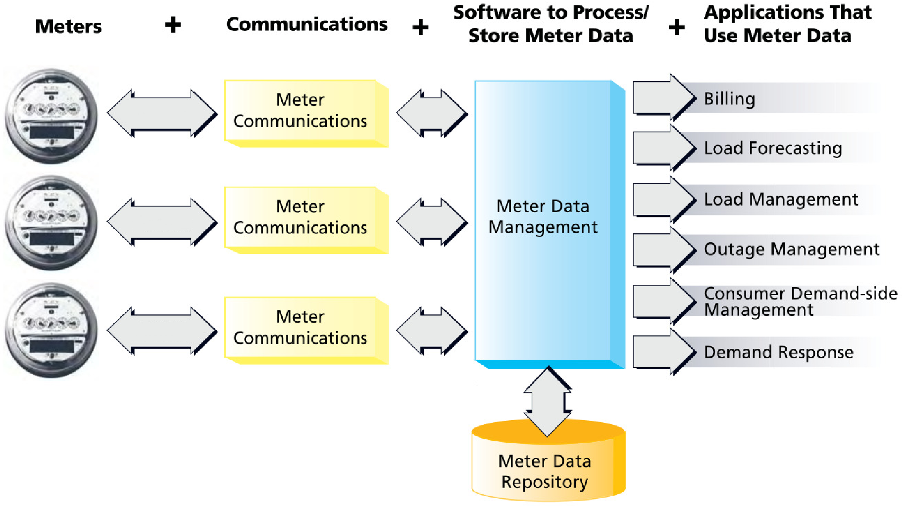

Figure 6: Smart metering system architecture and data usage applications (Waters 2006).

Despite the benefits, smart meters raise concerns about the privacy of consumers. Electricity data may contain private sensitive information, such as which appliances are being used, if the house is empty, when people take a shower or shut down the television. The privacy issues are some of the main reasons why smart meters were still not deployed in many countries (Koehle 2012). Clearly, there is a trade-off between utility and privacy.

As an example of the data format, Figure 7 shows a daily profile of a residential consumer.<a href="#fn3" class="footnoteRef" id="fnref3">3</a> Using advanced power signature analysis tools, such as the <em>Non-Intrusive Appliance Load Monitoring</em> (<em>NIALM</em>), it is possible to find out private information about the consumer’s lifestyle. Batra <em>et al.</em> (Batra et al. 2014) designed some methodologies to identify the use of appliances from load profiles. In Figure 7, the appliance with highest wattage and easier to identify is the laundry dryer. If the load monitoring algorithm is running remotely, the consumers may not know that their behaviors are being monitored.

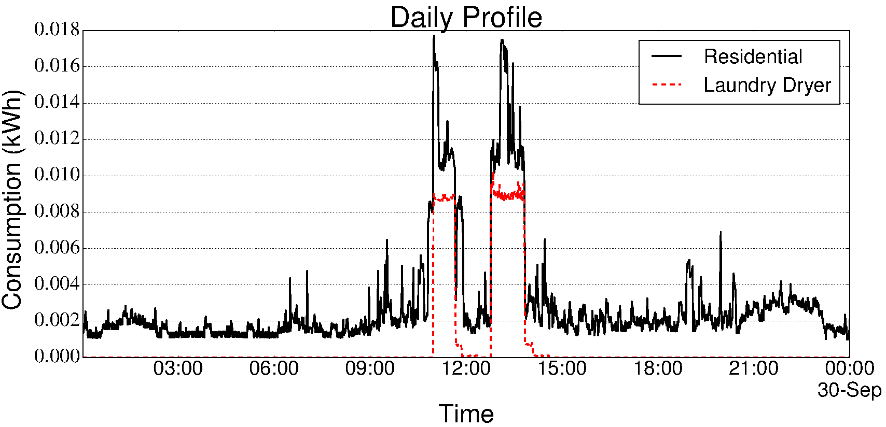

Figure 7: Residential (black solid) and Laundry Dryer (red dashed) daily profiles with measurements at each 1 minute.

In a traditional industrial setting, such behavior information is not in principle useful for a power provider. However, currently this type of information is of interest to many businesses that want to identify the profile of a potential consumer of their products and services. Therefore, disclosing such profiles and habits of consumers evokes issues about privacy. Clear rules are needed to protect consumers from misuse of their behavioral data and to avoid that Smart Grids become a new type of Big Brother (Boccuzzi 2010). Unfortunately, protection laws may take decades to be applied whereas smart meters are already operational.

<h2 id="sec:normssmartmetering">Norms and Legislation</h2>

Regarding the activity of checking compliance with norms and legislations for the energy data, the <em>Brazilian National Agency of Electrical Energy</em> (<em>ANEEL</em>) establishes a normative resolution<a href="#fn4" class="footnoteRef" id="fnref4">4</a> with the following rule of privacy for smart metering: “<em>In the hypothesis of a metering system with a remote communication, the power provider has to adopt procedures and technologies to ensure the security of the data traffic and, specially, of the collected personal information</em>”. In other words, this rule determines that security mechanisms such as encryption and certification must be used.

In the same article, <em>ANEEL</em> establishes another rule: “<em>It is forbidden for the power provider to disclose to third parties the data collected from consumer units without authorization of the owners</em>”. These rules could help to provide some evidences of privacy, but unfortunately they were suspended by the agency since February 11, 2014. Moreover, even if they come back in the future, it is known that there are possibilities of external hackers to penetrate systems (including the Meter Data Management in the power provider), or internal malicious employees to export the data after a decryption.

Another rule<a href="#fn5" class="footnoteRef" id="fnref5">5</a> established by <em>ANEEL</em> is: “<em>The meters must have mass storage capable of storing active and reactive energy data, demand and tension, considering the direct and reverse flow of energy according to the usage, at programmable intervals of 5 (five) to 60 (sixty) minutes</em>”. The granularity of 5 minutes is the important information here. This could help to provide evidences of privacy, however it is known that <em>NIALM</em> algorithms can still identify appliance usages with this granularity. Moreover, this rule is only applied to official and regulated meters. The energy meter used by the LiteMe application is just an additional device that does not have the goal to replace existing traditional meters. Therefore, for many purposes, this device has the ability to collect and send data with time intervals of 1 second.

Despite the lack of norms and legislation to be applied in this application, the study and the summary of possibilities suggest a concern for privacy in this project, generating this, an evidence of privacy. Table 4 describes a sheet for this evidence <em>E</em>1 and Figure 8 presents the first part of the <em>GSN</em> for the privacy case of a smart metering application. This representation is still to grow, according to the normal software evolution and our proposed methodology. In this application context, assuming that security assurances have been taken, there is an argument that the privacy is being preserved according to the provided evidences. For now, there is only one evidence provided (<em>E</em>1).

<table>
  <caption>Table 4: Sheet for the evidence <em>E</em>1. Norms and legislations for smart metering.</caption>
  <tr>
    <td align="left">E1</td>
    <td align="left">Norms and legislations have been studied</td>
    <td align="left"><b>Status:</b> Done</td>
    <td align="left"><b>Review Date:</b> August 2015</td>
    <td align="left"><b>Weight:</b> 1</td>
  </tr>
  <tr>
    <td colspan="5"><i>PbE Activity</i>: Check Compliance with Norms and Legislation</td>
  </tr>
  <tr>
    <td colspan="5"><i>Driven by</i>: G1 → G2; <i>In context of</i>: C1; <i>Assumptions</i>: As1</td>
  </tr>
  <tr>
    <td colspan="5"><u>Description</u>: Possible norms and legislations that could be applied for the smart metering application have been studied and summarized. In Brazil, it was not found any norm or law dealing with the collection, storage and processing of energy metering data that could affect the design of the LiteMe application. There are norms proposed by the <i>ANEEL</i>, but only applied to official and regulated meters.</td>
  </tr>
    <tr>
    <td colspan="5"><u>References</u>: <a href="https://pedroysb.github.io/Privacy-by-Evidence/case1#norms-and-legislation">Norms and Legislation</a> </td>
  </tr>
</table>

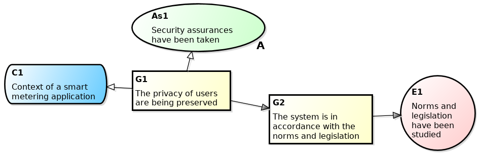

Figure 8: First iteration of the construction of the <em>GSN</em> representation for the privacy case of a smart metering application.

<h2 id="sec:smrisk">Utilities and Risk Assessment</h2>

For the risk assessment, first we identified what is possible to do with the collected energy data. Since individual values (such as the consumption of a house in an instant of time) are more sensitive than aggregate values (such as the total consumption in a region with <em>N</em> consumers, or the total consumption of a house in the end of a billing period), the privacy techniques need to focus on hiding individual values.

Many utilities that use metering data were listed in Table 5. From this list, using a risk binary scale, “load forecasting for individual consumers”, “individual data analytics” and “demand-based rates” were considered as privacy threats that needed to be solved. This classification is based on the usage of individual values. The check if a utility uses individual values (and thus if it is a privacy risk) can be found in the references.

Unfortunately, “demand-based rates” may be a legitimate utility but regarded as a privacy risk. Power providers would charge based on the instantaneous power, but to do that, it is necessary to know the individual measurements.

<table>
  

  <caption>Table 5: List of metering data utilities.</caption>
  <tr>
    <td align="center" style='font-weight:bold;'>Feature / Benefit</td>
    <td align="center" style='font-weight:bold;'>Privacy Risk?</td>
  </tr>
  <tr>
    <td align="center" >Billing optimization (Barbosa et al. 2014)</td>
    <td align="center" style="color:green">No</td>
  </tr>
  <tr>
    <td align="center" >Load monitoring and management for specific groups or regions (Barbosa et al. 2014)</td>
    <td align="center" style="color:green">No</td>
  </tr>
  <tr>
    <td align="center" >Energy theft/losses detection (Anas et al. 2012)</td>
    <td align="center" style="color:green">No</td>
  </tr>
  <tr>
    <td align="center" >Load forecasting for specific groups or regions (Ilić et al. 2013)</td>
    <td align="center" style="color:green">No</td>
  </tr>
  <tr>
    <td align="center" >Load forecasting for individual consumers (Ilić et al. 2013)</td>
    <td align="center" style="color:orange">Yes</td>
  </tr>
  <tr>
    <td align="center" >Time-based rates (<em>e.g.</em>, different prices based on time of day and season) (Barbosa et al. 2014)</td>
    <td align="center" style="color:green">No</td>
  </tr>
  <tr>
    <td align="center" >Demand-based rates (<em>e.g.</em> different prices based on demand levels) (Procel 2011)</td>
    <td align="center" style="color:orange">Yes</td>
  </tr>
  <tr>
    <td align="center" >Individual data analytics (<em>e.g.</em> <em>NIALM</em> and marketers) (Barbosa, Brito, and Almeida 2015; NIST 2014)</td>
    <td align="center" style="color:orange">Yes</td>
  </tr>
  <tr>
    <td align="center" >In-home feedback tools: estimated bills, device profiles etc (Ying-Xun et al. 2013)</td>
    <td align="center" style="color:green">No</td>
  </tr>
  

</table>

<h3 id="adversary-model">Adversary Model</h3>

In the smart metering privacy literature, it is common to consider the power provider as an adversary (honest, but curious) and, transitively, the data exposure to third parties becomes a threat to privacy too. Therefore, it is resonable to consider the power provider as an adversary and to apply the privacy techniques on the consumers’ side (Busom et al. 2015; Erkin and Tsudik 2012; Garcia and Jacobs 2010; Backes and Meiser 2014; Kalogridis et al. 2010; McLaughlin, McDaniel, and Aiello 2011; Zhao et al. 2014; Backes and Meiser 2014; Kalogridis et al. 2010; McLaughlin, McDaniel, and Aiello 2011; Zhao et al. 2014). Figure 9 presents the second iteration of the construction of the <em>GSN</em> representation for this case study. The diagram now considers the adversary model, <em>i.e.</em>, the assumption that the sensor is not an adversary and the strategy to provide mitigations considering that the service is an adversary.

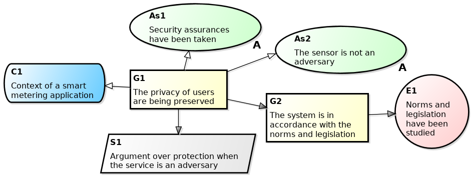

Figure 9: Second iteration of the construction of the <em>GSN</em> representation for the privacy case of a smart metering application.

<h2 id="sec:sm_priv_techniques">Privacy Techniques</h2>

With the considerable amount of privacy-preserving techniques that can be adopted to ensure privacy in smart metering, the need to better understand and compare these solutions rise. In general, there are techniques based on homomorphic encryption (Busom et al. 2015; Erkin and Tsudik 2012; Garcia and Jacobs 2010), the techniques that use rechargeable batteries (Backes and Meiser 2014; Kalogridis et al. 2010; McLaughlin, McDaniel, and Aiello 2011; Zhao et al. 2014), and the ones that make use of noise addition (S. Wang et al. 2012; Bohli, Sorge, and Ugus 2010; He, Zhang, and J. Kuo 2013; Barbosa, Brito, and Almeida 2016). Since the main privacy issues are derived from individual data, these privacy preserving approaches tend to reveal aggregate data and hide individual data.

To enable power providers to process smart meter measurements, while preventing them to access private data, cryptographic tools like homomorphic encryption may be used. With these approaches, before sending its measurement, each smart meter runs a cryptographic routine. The power provider receives encrypted measurements, but can still perform useful computations and output the correct aggregate values, like the total consumption of a consumer during a billing period or the total consumption in the region in an instant of time. Thus, some benefits of using smart metering are still provided, while the consumer privacy is maintained.

Techniques based on the usage of rechargeable batteries consist in using a battery between the smart meter and home appliances. Therefore, the disclosed information is the battery load profile, but not the daily activities and appliance usages of consumers.

Through noise addition techniques, individual measurements are masked by adding random numbers. This masking happens in a way that does not affect the outcome of the aggregating operations but hides the individual measurements.

The privacy techniques were evaluated (Barbosa et al. 2016), and it was concluded that noise addition stands out from the others. Despite the disadvantage in accuracy, it has a low complexity, scalability, meters’ independence, low cost and low environmental impact (this one, when compared with rechargeable batteries approach).

<h3 id="sec:noise">Noise Addition</h3>

Noise addition is a privacy preserving technique to mask the data. Wang <em>et al</em>. (S. Wang et al. 2012) propose an approach to mask the data adding random numbers from a <em>Gaussian Mixture Models</em> (<em>GMM</em>), whereas Bohli <em>et al</em>. (Bohli, Sorge, and Ugus 2010) and He <em>et al</em>. (He, Zhang, and J. Kuo 2013) propose approaches to mask the data using Gaussian noise. Noise addition is a promising and efficient technique, however, these mentioned approaches do not have formal models to calculate the amount of noise that should be added to guarantee desired privacy and utility levels. In fact, He <em>et al</em>. (He, Zhang, and J. Kuo 2013) argue that for real world system design, a proper trade-off between privacy protection and accuracy should be considered.

We propose that for every measurement, the smart meter reads the consumption and adds a random number (Barbosa et al. 2014). Thus, after an aggregating operation (such as the calculation of the total consumption in a region or the total consumption of a consumer in the end of a billing period), the result will be:  
  
  &sum;i=1N ci ~ &sum;i=1N ( ci + xi )  
  
  where <em>N</em> is the total number of measurements, <em>x</em><em>i</em> is a random number generated from a probabilistic distribution and <em>c</em><em>i</em> is an individual consumption measurement.

The previous formalization can also be rewritten as follows:  $$\sum_{i=1}^N c_i\ =\ \sum_{i=1}^N \left( c_i\ +\ x_i \right)\ -\ e_o$$  where <em>e</em><em>o</em> is the obtained error by the addition of random numbers. Therefore, <em>e</em><em>o</em> is the sum of all added random values:  $$e_o\ =\ \sum_{i=1}^N x_i \text{ .}$$ 

We developed many analytical models using probability theory for different distributions (Barbosa, Brito, and Almeida 2015). Here we consider the Laplace distribution. Let <em>x</em><em>i</em> be a random variable generated from this distribution. Its variance is <em>σ</em><em>x</em>2  =  2<em>b</em>2, where <em>b</em> is a scale parameter. Now, for a large <em>N</em>, the central limit theorem ensures that the obtained error for billing purpose follows a normal distribution with mean <em>μ</em><em>e</em><em>o</em> = 0 and variance:  <em>σ</em><em>e</em><em>o</em>2  =  <em>N</em>2(<em>σ</em><em>x</em>2 / <em>N</em>)  =  <em>N</em><em>σ</em><em>x</em>2  = 2<em>N</em><em>b</em>2 . 

In other words, to have an obtained error between two accepted values (with high probability), we can use the following normal distribution:  <em>e</em><em>o</em>  ∼  <em>N</em>(0, 2<em>N</em><em>b</em>2) . 

As an example, Figure 7 shows a daily profile of a residential consumer. There are 16 appliances in this consumption profile. However, the appliance with highest wattage and easier to identify is the laundry dryer. Assuming the billing period as one month, the total consumption of this consumer during the billing period (one month of 31 days) is 131.978 kWh. Considering a maximal allowed error of 5% for billing purpose, we have 6.5989 kWh. Thus, the variance for a high probability (<em>e.g.</em>, 0.98) of not exceeding this value is <em>σ</em><em>e</em><em>o</em>2 = 8.04626. Isolating the scale parameter <em>b</em> from Equation [eq:lapVar], we have (for measurements at each 1 minute, <em>N</em> = 44, 640):  $$b\ =\ \sqrt{\sigma_{e_o}^2 / \left(2 N \right)} \ =\ 0.0094934 \text{ .}$$ 

Figure 10 presents the daily profile of Figure 7 masked using this Laplacian noise. Considering that at the end of the month the power provider sums the informed masked values by the consumer, it obtains a value of 133.7977 kWh. The real value is 131.978 kWh. The difference between these values is an error of 1.3788%, less than the maximum allowed error (5%). This error may be less if the consumer does not mask the measurements all the time. Also, if the meter firmware accumulates the sum of the added random numbers and sends that with the last measurement of the month, the error is zero.

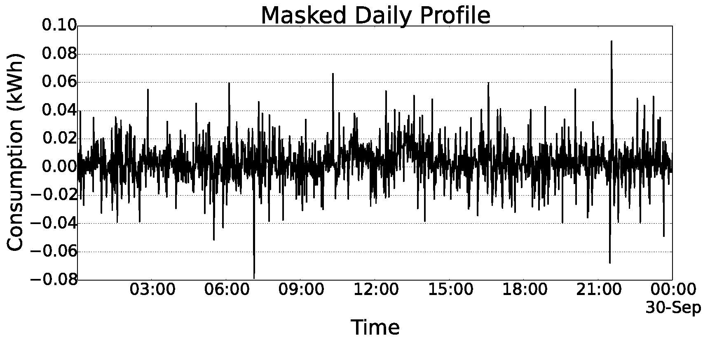

Figure 10: Residential masked daily profile with measurements at each 1 minute.

The existence of errors in applications of electrical networks are often found nowadays (since these errors should be less than established limits). For example, in Brazil, the INMETRO (National Institute of Metrology, Standardization and Industrial Quality) establishes percentual error limits to measurements for billing purposes. For residential customers (defined as class B), the percentual relative error for active energy must stay between +/- 2%, while for industrial customers (defined as class A), this error must stay between +/-3%. For more information see the ordinance number 375 of September 27, 2011 (INMETRO 2011).

A key feature of the approach is the possibility to allow the consumer and the power provider to negotiate the privacy and utility levels by just changing the allowed error/noise magnitude. Moreover, since this masking approach considers only the data that is disclosed to the power provider, it does not affect the customer’s ability of analyzing his own real consumption profile inside his home and identifying appliance usage (Ying-Xun et al. 2013).

We claim that the proposed approach is lightweight (Barbosa et al. 2014) because in order to preserve privacy the approach just generates a random number. Also, it is possible to provide differential privacy (Dwork 2006) guarantees for appliance usages, making them indistinguishable in a consumption profile (Barbosa, Brito, and Almeida 2016).

<h4 id="differential-privacy-for-appliances">Differential Privacy for Appliances</h4>

Dwork (Dwork 2006) proposed the notion of differential privacy for general datasets. A mechanism of obfuscation is differentially private if its outcome is not significantly affected by the removal or addition of a single dataset participant. Here, we instantiate this notion for datasets of energy consumption profiles.

Since the privacy is related with appliance usage (<em>i.e.</em>, the consumer behavior), we aim to achieve differential privacy for appliances in metering data without affecting the aggregate data. Thus, appliances are participants in consumption profiles and an adversary learns approximately the same information about any individual appliance, regardless of its presence or absence in the original profile.

Considering that a consumption profile is a set of appliances, we say profiles <em>P</em>1 and <em>P</em>2 differ in at most one appliance if one is a proper subset of the other and the larger dataset profile contains just one additional appliance.

An obfuscation mechanism <em>K</em> gives <em>ϵ</em>-differential privacy if for all profiles <em>P</em>1 and <em>P</em>2 differing in at most one appliance, and all <em>S</em> ⊆ <em>R</em><em>a</em><em>n</em><em>g</em><em>e</em>(<em>K</em>),  <em>P</em><em>r</em>[<em>K</em>(<em>P</em>1)∈<em>S</em>]≤<em>e</em><em>x</em><em>p</em>(<em>ϵ</em>)×<em>P</em><em>r</em>[<em>K</em>(<em>P</em>2)∈<em>S</em>]  where the probability is taken over the randomness of <em>K</em>.

The <em>ϵ</em> value is the privacy metric and for better privacy, a small value is desirable. A mechanism <em>K</em> satisfying this definition addresses concerns that any appliance might have about the leakage of its information: even if the appliance has been removed from the dataset, no outputs (and thus consequences of outputs) would become significantly more or less likely.

Differential privacy is achieved by the addition of noise whose magnitude is a function of the largest change a single appliance could have on the output profile; this quantity is referred as the sensitivity of the function.

For <em>f</em> : <em>P</em> → <em>R</em><em>k</em>, the sensitivity of <em>f</em> is  <em>Δ</em><em>f</em> = max<em>P</em>1, <em>P</em>2 ∥ <em>f</em>(<em>P</em>1)−<em>f</em>(<em>P</em>2)∥1  for all <em>P</em>1, <em>P</em>2 differing in at most one appliance.

In particular, when <em>k</em> = 1 the sensitivity of <em>f</em> is the maximum difference in the values that the function <em>f</em> may take on a pair of profiles that differ in only one appliance.

The privacy mechanism, denoted <em>K</em> for a query function <em>f</em>, computes <em>f</em>(<em>X</em>) and adds noise with a Laplace distribution with mean <em>μ</em> = 0 and scale parameter <em>b</em>:  <em>b</em> = <em>Δ</em><em>f</em>/<em>ϵ</em> ∴  <em>ϵ</em> = <em>Δ</em><em>f</em>/<em>b</em> . 

The variance of the noise distribution is 2<em>b</em>2. On query function <em>f</em> the privacy mechanism <em>K</em> responds with  <em>f</em>(<em>X</em>)+(<em>L</em><em>a</em><em>p</em>(<em>Δ</em><em>f</em>/<em>ϵ</em>))<em>k</em>  adding noise with distribution <em>L</em><em>a</em><em>p</em>(<em>Δ</em><em>f</em>/<em>ϵ</em>) independently to each of the <em>k</em> components of <em>f</em>(<em>X</em>). Note that decreasing <em>ϵ</em>, a publicly known parameter, flattens out the <em>L</em><em>a</em><em>p</em>(<em>Δ</em><em>f</em>/<em>ϵ</em>) curve, yielding larger expected noise magnitude.

[theorem:diffPriv] For <em>f</em> : <em>P</em> → <em>R</em><em>k</em>, the mechanism <em>K</em> that adds independently noise with distribution <em>L</em><em>a</em><em>p</em>(<em>Δ</em><em>f</em>/<em>ϵ</em>) gives <em>ϵ</em>-differential privacy.

The proof of Theorem [theorem:diffPriv] is straightforward and Dwork gives this proof for general datasets in (Dwork 2008). This theorem describes a relationship between <em>Δ</em><em>f</em>, <em>b</em>, and the differential privacy. To achieve <em>ϵ</em>-differential privacy, one must choose <em>b</em> ≥ <em>Δ</em><em>f</em>/<em>ϵ</em>. Given a sufficiently small <em>ϵ</em>, differential privacy limits the ability of an adversary to identify an appliance in the consumption profile.

Note that it is not hard for a user (or an automated mechanism) to identify the wattage of an appliance purchased. That said, the global sensitivity of the profile from Figure 7 is the maximum variation of the appliance with highest wattage (laundry dryer):

 <em>Δ</em><em>f</em> = 0.01022 . 

We can conclude that, from Equation [eq:b], using an utility requirement of 5%, the achieved privacy level in this example is:  $$\epsilon = \frac{\Delta f}{b} = 1.077 \text{ .}$$ 

In the literature of differential privacy, some researchers argue that the value of <em>ϵ</em> may be relative because for the same value of <em>ϵ</em>, the probability of identifying a participant is dependent on the context. Lee et al. (Lee and Clifton 2011) propose a technique to, in accordance with a context, find a suitable value of <em>ϵ</em>:  $$\epsilon = \frac{\Delta f}{\Delta v} \ln \frac{(n - 1)p}{1-p} 
  \label{eq:goodEpsilon}$$  where <em>Δ</em><em>v</em> is the largest distance of possible values, <em>p</em> is the probability of identifying the presence of an individual and <em>n</em> is the number of individuals in the data set. In the previous example for the consumption profile, we have <em>Δ</em><em>v</em> = 0.0178 (highest value presented in the profile) and <em>n</em> = 16 (number of appliances). Thus, considering that the probability of identifying the usage of an appliance is 1/3, it is suggested to have:  $$\epsilon \leq \frac{0.01022}{0.0178} \ln \frac{15 \cdot 3}{3 \cdot 2} = 1.1568 \text{ .}$$ 

Since in our example the obtained value of <em>ϵ</em> is 1.077, we can conclude that an attacker has a probability of identifying the laundry dryer less than 1/3. In other words, on average, he/she has to try more than three moments to be able to guess one moment of usage of the laundry dryer (and maybe he/she does not know that).

Rearranging Equation [eq:goodEpsilon], we can determine the probability:  $$p = \frac{1}{1 + (n - 1) \cdot exp(- \frac{\epsilon \Delta v}{\Delta f})} \text{ .} 
  \label{eq:prob}$$ 

In Table [tab:appliances] we present the wattages and achieved privacy levels for some appliances of the profile from the previous example. The wattages were obtained from the Tracebase dataset (Reinhardt et al. 2012), the <em>ϵ</em> values were obtained from Equation [eq:b], and the probability values of identifying appliances were obtained from Equation [eq:prob].

M0.25M0.2M0.15M0.21 <strong>Appliance&amp; <strong>Max. Wattage &amp; <strong>Privacy (<em>ϵ</em>) &amp; <strong>Probability (<em>p</em>) 
Charger Smartphone &amp; ∼6 &amp; 0.001 &amp; 0.0626 
Router &amp; ∼9 &amp; 0.003 &amp; 0.0628 
Playstation 3 &amp; ∼130 &amp; 0.037 &amp; 0.0663 
TV LCD &amp; ∼140 &amp; 0.075 &amp; 0.0706 
PC Desktop &amp; ∼300 &amp; 0.077 &amp; 0.0708 
Refrigerator &amp; ∼1000 &amp; 0.099 &amp; 0.0733 
Printer &amp; ∼600 &amp; 0.127 &amp; 0.0767 
Water Fountain &amp; ∼260 &amp; 0.143 &amp; 0.0787 
Toaster &amp; ∼700 &amp; 0.257 &amp; 0.0944 
Cooking Stove &amp; ∼900 &amp; 0.276 &amp; 0.0973 
Vacuum Cleaner &amp; ∼1100 &amp; 0.336 &amp; 0.1068 
Iron &amp; ∼1500 &amp; 0.347 &amp; 0.1087 
Coffee Maker &amp; ∼1300 &amp; 0.353 &amp; 0.1097 
Microwave Oven &amp; ∼1400 &amp; 0.457 &amp; 0.1287 
Washing Machine &amp; ∼3000 &amp; 0.903 &amp; 0.2431 
Laundry Dryer &amp; ∼3500 &amp; 1.077 &amp; 0.3031 
</strong></strong></strong></strong>

As discussed before, lower values of <em>ϵ</em> or <em>p</em> imply better privacy. Naturally, the consumer behavior and privacy are correlated with the appliance usage and some of these information may be more sensitive than others.

As we can see in Table [tab:appliances], the appliance wattage is very correlated with the privacy level. However, some appliances with higher wattage have better privacy than some appliances with lower wattage. This is because the accumulated consumption (kWh) is not only dependent on the wattage, but also on the time of use of the appliance.

It is known that less measurements implies higher privacy. Taking an extreme example, if a consumer sends to the power provider only one measurement with the total consumption at the end of the billing period, the achieved privacy is much better than sending measurements at each 1 minute. However, when the number of measurements in a time period is large, our approach generates noise to hide each individual measurement, and the achieved privacy could be as higher as sending only one measurement with the total consumption at the end of the billing period.

Using the proposed model, it is also possible to calculate the achieved utility level for a given privacy requirement. From Equation and we have:  $$\sigma_{e_o}^2 = \frac{2 \cdot N \cdot \Delta f ^ 2}{\epsilon ^ 2} \text{ .}  
  \label{eq:utility}$$ 

Therefore, with this variation, the maximum obtained error (utility level) is easily calculated using the inverse cumulative density function (quantiles) of the normal distribution.

<h4 id="example-of-load-monitoring-in-a-region">Example of Load Monitoring in a Region</h4>

If each consumer masks his data based on the billing period, the power provider may obtain accurate values for billing. However, to obtain accurate values for load monitoring in a region, the number of consumers should be as many as possible because it is desired that the added noise should be unnoticed in the aggregated data used for load monitoring.

The data used in the next example are measurements collected at each 30 minutes from real residential consumers (anonymised) from Ireland (<em>Commission for Energy Regulation – CER</em>) (CER 2012). Suppose that the power provider wants to compute the total consumption in a region with many consumers through time for load monitoring (<em>e.g.</em>, find peak times, leak detection, load forecasting and many other applications). Using a billing period of 1 month and measurements at each 30 minutes, it has <em>N</em> = 1488 measurements for each consumer during a month with 31 days (March). So, in this experiment, we consider a region with 1488 consumers (thus, the data forms a square matrix). Figure 11 shows the regional profile during March obtained from original consumer profiles versus the regional profile obtained from masked profiles.

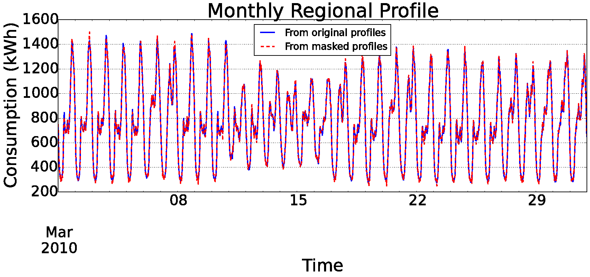

Figure 11: Regional profile using original data (blue solid) versus using masked data (red dashed) with measurements of 30 min. The profiles are very similar.

As depicted in Figure 11, visually there is no difference between the two profiles. However, the obtained errors depend on the population behavior. For example, in a high consumption period the obtained error has a different proportion from the obtained error in a low consumption period. The large errors in Figure 11 were obtained in periods of low consumption (<em>e.g.</em>, during the night), because while consuming less, consumers are still masking their data using a noise level based on the billing period. The blue dashed line in Figure 12 presents the obtained errors through time for this scenario (Figure 11). These errors may be lower if not all consumers decide to mask their data all the time.

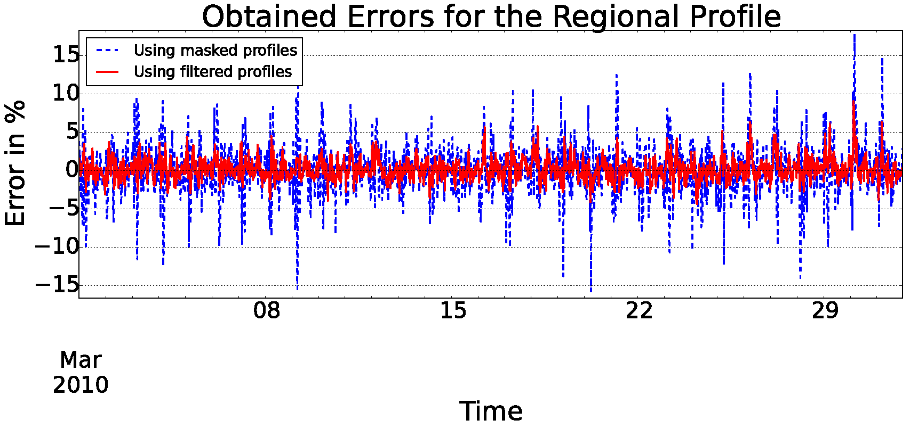

Figure 12: Obtained errors for the regional profile using masked profiles versus using filtered profiles. Using filtered profiles implies in better accuracy for load monitoring.

The possibility of having consumers deciding when to send masked (vs. original) measurements is in accordance with the privacy definition mentioned by Stallings <em>et al</em>. (Stallings and Brawn 2015) and can be implemented through a privacy switch (<em>i.e.</em>, enable or disable the masking). As not all consumers are masking the measurements all the time (making the obtained error to be lower), this implies in a utility improvement.

<h3 id="rechargeable-batteries">Rechargeable Batteries</h3>

Rechargeable batteries between appliances and smart meters can help to reduce the privacy issues as the appliance signatures are no longer legible (Backes and Meiser 2014; Kalogridis et al. 2010; McLaughlin, McDaniel, and Aiello 2011; Zhao et al. 2014).

Mclaughlin <em>et al</em>. (McLaughlin, McDaniel, and Aiello 2011) propose an approach called <em>Non-Intrusive Load Leveling</em> (<em>NILL</em>). The goal of a <em>NILL</em> system is to level the load profile to a constant <em>target load</em>, thus removing appliance signatures. When an appliance turns ON, it will exert a load beyond the target load. Thus, <em>NILL</em> will discharge the battery to partially supply the load created by the appliance, maintaining the target load. Similarly, if an appliance enters the OFF state, the load profile will decrease below the target load. These opportunities are used to charge the battery while restoring the target load.

The <em>NILL</em> system consists of two parts: a battery and a control system that regulates the battery’s charge and discharge based on the present load and battery state. The controller attempts to maintain a steady state target load <em>K</em><em>S</em><em>S</em>, but will go into one of two special states <em>K</em><em>L</em> or <em>K</em><em>H</em> if the battery needs to recover from a low or high state of charge.

The essence of <em>NILL</em> is described by the equation, <em>u</em>(<em>t</em>)=<em>d</em>(<em>t</em>)+<em>b</em>(<em>t</em>), where <em>b</em>(<em>t</em>) is the battery’s rate of charge overtime, <em>d</em>(<em>t</em>) is the actual load profile of the residence and <em>u</em>(<em>t</em>) is the load under the influence of <em>NILL</em> as perceived by the smart meter and what is disclosed to the power provider. If <em>b</em>(<em>t</em>)&gt;0, the battery is charging, otherwise <em>b</em>(<em>t</em>)&lt;0 and the battery is discharging. Finally, <em>c</em>(<em>t</em>) is used to represent the battery’s state of charge, thus:  <em>c</em>(<em>t</em>)=∫<em>t</em>0<em>t</em><em>b</em>(<em>t</em>)<em>d</em><em>t</em> + <em>c</em>(<em>t</em>0) . 

Therefore, <em>c</em>(<em>t</em>) is monitored. If <em>c</em>(<em>t</em>)&lt;<em>L</em>, where <em>L</em> is the lower safe limit on the battery’s state of charge, then the battery needs to be recharged and the system goes to the <em>K</em><em>L</em> state. Similarly, if <em>c</em>(<em>t</em>)&gt;<em>H</em>, the system goes to the <em>K</em><em>H</em> state and the battery is discharged.

<h3 id="using-a-modified-elgamal-encryption">Using a Modified ElGamal Encryption</h3>

The first homomorphic encryption solution that we consider is based on a modification in the ElGamal encryption, a cryptographic system that relies on the discrete logarithm problem. The ElGamal cryptosystem proceeds as follows:

<ul>
<li>
<em>Set up</em>: a large prime <em>q</em> is chosen. Next, a generator <em>g</em> of the cyclic group ℤ<em>q</em>* is selected.
</li>
<li>
<em>Key generation</em>: a secret key <em>x</em> is generated by setting its value as a random number <em>x</em>∈<em>R</em>ℤ<em>q</em>*. The corresponding public key is computed as <em>y</em> = <em>g</em><em>x</em>.
</li>
<li>
<em>Encryption</em>: a message <em>m</em> ∈ <em>G</em> is encrypted under public key <em>y</em> by taking a random number <em>r</em>∈<em>R</em>ℤ<em>q</em>* and computing <em>c</em> = <em>g</em><em>r</em> and <em>d</em> = <em>m</em> ⋅ <em>y</em><em>r</em>. The ElGamal encryption of <em>m</em> under public key <em>y</em>, <em>E</em><em>y</em>(<em>m</em>), is the tuple (<em>c</em>, <em>d</em>).
</li>
<li>
<em>Decryption</em>: a ciphertext <em>E</em><em>y</em>(<em>m</em>) is decrypted using the private key <em>x</em> by computing <em>m</em> = <em>d</em> ⋅ <em>c</em>−<em>x</em>.
</li>
</ul>

Given messages <em>m</em>1 and <em>m</em>2, we can obtain an encryption of <em>m</em>1 ⋅ <em>m</em>2 by computing:  $$\begin{aligned}
  E_y(m_1) \cdot E_y(m_2) &amp;= (c_1 \cdot c_2, d_1 \cdot d_2) \\
  &amp;= (g ^ {r_1 + r_2}, m_1 \cdot m_2 \cdot y ^ {r_1 + r_2}) \\
  &amp;= E_y(m_1 \cdot m_2) \text{ .}\end{aligned}$$  Hence, ElGamal is a multiplicative homomorphic cryptosystem.

To calculate the total consumption in a region, Busom <em>et al</em>. (Busom et al. 2015) propose a protocol which uses an additive ElGamal cryptosystem. Given <em>E</em><em>y</em>(<em>g</em><em>m</em>1) and <em>E</em><em>y</em>(<em>g</em><em>m</em>2), then, <em>E</em><em>y</em>(<em>g</em><em>m</em>1)⋅<em>E</em><em>y</em>(<em>g</em><em>m</em>2)=<em>E</em><em>y</em>(<em>g</em><em>m</em>1 ⋅ <em>g</em><em>m</em>2)=<em>E</em><em>y</em>(<em>g</em><em>m</em>1 + <em>m</em>2).

Initially, each smart meter possess the following values: a big prime number <em>q</em> and its generator <em>g</em>; a secret key <em>x</em><em>i</em>; a public key <em>y</em><em>i</em> = <em>g</em><em>x</em><em>i</em>. To encrypt the measurements, it is necessary a global public key $y = \prod\limits_{i=1}^{N} y_i$.

Let <em>m</em><em>i</em> denote the measurement of a smart meter. To calculate the total consumption in the region, the following protocol is executed:

<ol>
<li>
Each meter generates a random noise value <em>z</em><em>i</em> ∈ ℤ<em>q</em>* and computes a ciphertext as <em>C</em><em>i</em> = <em>E</em><em>y</em>(<em>g</em><em>m</em><em>i</em> + <em>z</em><em>i</em>)=(<em>c</em><em>i</em>, <em>d</em><em>i</em>) which is sent to the aggregator (which can be the power provider).
</li>
<li>
The aggregator combines all the messages as $C = (\prod\limits_{i=1}^{N}c_i, 
    \prod\limits_{i=1}^{N}d_i) = (c,d)$ and sends <em>c</em> to each meter.
</li>
<li>
Each meter computes <em>T</em><em>i</em> = <em>c</em><em>x</em><em>i</em> ⋅ <em>g</em><em>z</em><em>i</em> and sends the result to the aggregator. After that, each meter removes <em>z</em><em>i</em> from its memory.
</li>
<li>
Finally, the aggregator computes $D = d \cdot (\prod\limits_{i=1}^{N}T_i)^{-1}$ and $log_gD = M = \sum\limits_{i=1}^{N}m_i$, where <em>M</em> is the total consumption in the region.
</li>
</ol>

Notice that, since <em>M</em> is a relatively small number, the discrete logarithm problem in step 4 can be solved in a short time. In step 2, the aggregator computes:  $$C = (\prod\limits_{i=1}^N g^{r_i}, \prod\limits_{i=1}^N g^{m_i + z_i} \cdot y^{r_i}) = 
  (g^r, g^{M + z} \cdot y^r) = (c , d) \text{ ,}$$  and in step 3, each meter computes:  <em>T</em><em>i</em> = <em>c</em><em>x</em><em>i</em> ⋅ <em>g</em><em>z</em><em>i</em> = <em>g</em><em>r</em> ⋅ <em>x</em><em>i</em> ⋅ <em>g</em><em>z</em><em>i</em> = <em>g</em><em>x</em><em>i</em> ⋅ <em>r</em> ⋅ <em>g</em><em>z</em><em>i</em> = <em>y</em><em>i</em><em>r</em> ⋅ <em>g</em><em>z</em><em>i</em> .  Therefore, the protocol works because in step 4 the aggregator computes:  $$D = d \cdot (\prod\limits_{i=1}^N T_i)^{-1} = \dfrac{g^{M + z} \cdot
y^r}{\prod\limits_{i=1}^N (y_i^r \cdot g^{z_i})} = \dfrac{g^{M + z} \cdot
y^r}{(\prod\limits_{i=1}^N y_i^r) \cdot g^z} = \dfrac{g^{M + z} \cdot
y^r}{g^z \cdot y^r} = g^M \text{ .}$$ 

<h3 id="using-paillier-encryption-and-secret-sharing">Using Paillier Encryption and Secret Sharing</h3>

A protocol based on Paillier encryption and <em>secret sharing</em> was proposed by Garcia <em>et al</em>. (Garcia and Jacobs 2010). The Paillier cryptosystem proceeds as follows:

<ul>
<li>
<em>Set up</em>: two large primes <em>p</em> and <em>q</em> are chosen, <em>n</em> = <em>p</em> ⋅ <em>q</em>, and <em>λ</em> = <em>l</em><em>c</em><em>m</em>(<em>p</em> − 1, <em>q</em> − 1). A random number <em>g</em>∈<em>R</em>ℤ<em>n</em>2* is chosen in such a way that <em>g</em><em>c</em><em>d</em>(<em>b</em>, <em>n</em>)=1, where <em>b</em> = <em>L</em>(<em>g</em><em>λ</em> <em>m</em><em>o</em><em>d</em> <em>n</em>2) and $L(u) = \frac{(u-1)}{n}$.
</li>
<li>
<em>Key generation</em>: let <em>μ</em> be the modular multiplicative inverse of <em>b</em> modulo <em>n</em>, <em>i.e.</em>, <em>μ</em> = <em>b</em>−1 <em>m</em><em>o</em><em>d</em> <em>n</em>. Thus, the public key is <em>P</em><em>k</em> = (<em>n</em>, <em>g</em>) and the private key is <em>S</em><em>k</em> = (<em>n</em>, <em>λ</em>, <em>μ</em>).
</li>
<li>
<em>Encryption</em>: a message <em>m</em> is encrypted under public key <em>P</em><em>k</em> by taking a random number <em>r</em>∈<em>R</em>ℤ<em>n</em> − 1* and computing <em>E</em><em>P</em><em>k</em>(<em>m</em>)=<em>g</em><em>m</em> ⋅ <em>r</em><em>n</em> <em>m</em><em>o</em><em>d</em> <em>n</em>2.
</li>
<li>
<em>Decryption</em>: a ciphertext <em>c</em> = <em>E</em><em>P</em><em>k</em>(<em>m</em>) is decrypted using the private key <em>S</em><em>k</em> by computing <em>m</em> = <em>L</em>(<em>c</em><em>λ</em> <em>m</em><em>o</em><em>d</em> <em>n</em>2)⋅<em>μ</em> <em>m</em><em>o</em><em>d</em> <em>n</em>.
</li>
</ul>

Given messages <em>m</em>1 and <em>m</em>2, we can obtain an encryption of <em>m</em>1 + <em>m</em>2 by computing:  $$\begin{aligned}
  E_{P_k}(m_1) \cdot E_{P_k}(m_2) &amp;= g^{m_1} \cdot r^n_1 \cdot g^{m_2} \cdot r^n_2\ mod\ n^2\\
  &amp;= g ^ {m_1 + m_2} \cdot (r_1 \cdot r_2)^n\ mod\ n^2\\
  &amp;= E_{P_k}(m_1 + m_2) \text{ .}\end{aligned}$$  Hence, Paillier is an additive homomorphic cryptosystem.

Garcia <em>et al</em>. (Garcia and Jacobs 2010) propose that each smart meter possess a public key <em>P</em><em>k</em><em>i</em> and a private key <em>S</em><em>k</em><em>i</em>. Let <em>m</em><em>i</em> denote the measurement of the meter. To calculate the total consumption in the region, the following protocol is executed:

<ol>
<li>
Each meter sends its public key to the aggregator.
</li>
<li>
The aggregator receives all public keys and shares them with all meters. Thus, each meter stays with its private key <em>S</em><em>k</em><em>i</em> and all the public keys {<em>P</em><em>k</em>1, <em>P</em><em>k</em>2, …, <em>P</em><em>k</em><em>n</em>}.
</li>
<li>
Each meter calculates <em>N</em> secret shares for its measurement <em>m</em><em>i</em>, in such a way that $m_i = \sum\limits_{j=1}^N s_{ij}$. Then, the meter keeps <em>s</em><em>i</em><em>i</em> privately and sends to the aggregator all the other secret shares encrypted with the public keys of the other <em>N</em> − 1 meters, <em>i.e.</em>, it sends <em>E</em><em>P</em><em>k</em><em>j</em>(<em>s</em><em>i</em><em>j</em>) for <em>j</em> = 1, …, <em>i</em> − 1, <em>i</em> + 1, …, <em>N</em>.
</li>
<li>
After receiving all the encrypted secret shares, the aggregator multiplies the ones encrypted with the same public key. Due to the Paillier homomorphic property, for each meter <em>i</em>, it has $E_{P_{ki}}(m_i') = \prod\limits_{j \neq i}^N E_{P_{ki}}(s_{ji}) =
    E_{P_{ki}}(\sum\limits_{j \neq i}^N s_{ji})$. Then, the aggregator sends <em>E</em><em>P</em><em>k</em><em>i</em>(<em>m</em><em>i</em>′) for each meter <em>i</em>.
</li>
<li>
Using its private key <em>S</em><em>k</em><em>i</em>, each meter decrypts <em>E</em><em>P</em><em>k</em><em>i</em>(<em>m</em><em>i</em>′) and adds its <em>s</em><em>i</em><em>i</em>, obtaining $\sum\limits_{j=1}^N s_{ji}$. The meter then sends this value to the aggregator.
</li>
<li>
Finally, the aggregator can sum all the received values, obtaining the total consumption in the region $M = \sum\limits_{i=1}^N\sum\limits_{j=1}^N s_{ji}$.
</li>
</ol>

In this approach, the total consumption in the region is computed and at the same time, neither the aggregator nor any other consumer has access to any real measurement from a consumer, for they can only access random shares. Since in step 6 the aggregator simply sum all the secret shares, the proof that the protocol works is straightforward.

<h3 id="using-a-modified-paillier-encryption">Using a Modified Paillier Encryption</h3>

Erkin <em>et al</em>. (Erkin and Tsudik 2012) propose a protocol based on a modification in the Paillier encryption. Starting, there is a single pair of Paillier keys (<em>P</em><em>k</em> and <em>S</em><em>k</em>) shared with all <em>N</em> meters. Let <em>m</em><em>i</em> denote the measurement of the meter. To calculate the total consumption in the region, the following protocol is executed:

<ol>
<li>
Each meter generates <em>N</em> − 1 random numbers, one for every one of the other meters, and sends them using secure communication (<em>e.g.</em>, RSA encryption between meters). Thus, there is a total of <em>N</em> ⋅ (<em>N</em> − 1) message exchanges in this step.
</li>
<li>
After receiving all the random numbers generated by the other meters, the meter computes $R_i = n + \sum\limits_{j \neq i}^N r_{(i \to j)} - \sum\limits_{j \neq i}^N r_{(j \to i)}$, where <em>n</em> is the Paillier modulo and <em>r</em>(<em>i</em> → <em>j</em>) is the random number generated by the meter <em>i</em> for the meter <em>j</em>.
</li>
<li>
Following, the meter computes a hash <em>h</em><em>t</em> using the timestamp of the current measurement <em>m</em><em>i</em>. This hash must be coprime with the Paillier modulo <em>n</em>, <em>i.e.</em>, <em>g</em><em>c</em><em>d</em>(<em>h</em><em>t</em>, <em>n</em>)=1. Since the timestamp is synchronized, the obtained hash is the same for all meters.
</li>
<li>
After computing <em>R</em><em>i</em> and <em>h</em><em>t</em>, the meter encrypts <em>m</em><em>i</em> using the following modified scheme of Paillier: <em>E</em><em>P</em><em>k</em>(<em>m</em><em>i</em>)=<em>g</em><em>m</em><em>i</em> ⋅ <em>h</em><em>t</em><em>R</em><em>i</em>. Then, this encrypted measurement is disclosed to all other <em>N</em> − 1 meters.
</li>
<li>
Finally, after receiving all the encrypted measurements of the other meters, the meter calculates $E_{P_k}(M) = \prod\limits_{i = 1}^N E_{P_k}(m_i) = 
    E_{P_k}(\sum\limits_{i=1}^N m_i)$. This is true due the homomorphic property.
</li>
</ol>

Possessing <em>E</em><em>P</em><em>k</em>(<em>M</em>), the meter can decrypt this value and then send the total consumption in the region <em>M</em> to the aggregator. This way, the total consumption is computed and privacy is preserved, for the meter does not have access to the other measurements in plaintext.

The protocol works because in step 5, the meter computes:

 $${E_{P_k}(M) = g^{m_1 + m_2 + \dots + m_N}} \cdot {h_t^{(\sum\limits_{i=1}^N n) + 
  (\sum\limits_{i=1}^N \sum\limits_{j \neq i}^N r_{(i \to j)}) - (\sum\limits_{i=1}^N
  \sum\limits_{j \neq i}^N r_{(j \to i)}) }} \text{ ,}$$ 

and  <em>E</em><em>P</em><em>k</em>(<em>M</em>)=<em>g</em><em>M</em> ⋅ <em>h</em><em>t</em><em>N</em> ⋅ <em>n</em> .  Considering that <em>r</em> = <em>h</em><em>t</em><em>N</em>, this configuration represents the original paillier cryptosystem.

<h3 id="sec:performance">Performance Evaluation of Privacy Techniques</h3>

In order to analyze and compare solutions, we describe the performance aspects that are considered in our studies. This analysis is important because, for example, solutions might excel at low computational complexity but their installation and usage has high costs and harms the environment. Thus, the need to consider different aspects of performance. In this section, we present an experiment that aims to compare the response time (which is related to computational complexity) of the approaches. We also discuss other aspects, such as: scalability, meters’ independence, cost, environmental impact and accuracy. Table [tab:relatedWork] presents a summary and comparison of the discussed approaches.

M0.32|M0.17|M0.17|M0.11 &amp; <strong>NA &amp; <strong>RB &amp; <strong>HE 
Low complexity &amp; &amp; &amp; 
Scalability &amp; &amp; &amp; 
Meters’ independence &amp; &amp; &amp; 
Low cost &amp; &amp; &amp; 
Low environmental impact &amp; &amp; &amp; 
Accuracy &amp; &amp; &amp; 
</strong></strong></strong>

Legend:

<ul>
<li>
<strong>NA</strong>: Noise Addition (Barbosa, Brito, and Almeida 2015);
</li>
<li>
<strong>RB</strong>: Rechargeable Batteries (McLaughlin, McDaniel, and Aiello 2011);
</li>
<li>
<strong>HE</strong>: Homomorphic Encryption (Busom et al. 2015; Garcia and Jacobs 2010; Erkin and Tsudik 2012);
</li>
</ul>
<h4 id="computational-complexity">Computational Complexity</h4>

Low complexity is desired mainly because most of the deployed smart meters are low-cost microcontrollers and with limited computational resources. Through the analysis of the solutions’ running time growth order, we have the complexities presented in Table [tab:complexities]. We consider that, regarding computational complexity, the noise addition and rechargeable batteries approaches stand in relation to the homomorphic encryption approaches.

<table>
<caption>Complexity analysis for different privacy preserving approaches in smart metering.</caption>
<tbody>
<tr class="odd">
<td align="left"><strong>Operation</strong></td>
<td align="center">SM</td>
<td align="center">AG</td>
<td align="center">SM</td>
<td align="center">AG</td>
<td align="center">SM</td>
<td align="center">AG</td>
<td align="center">SM</td>
<td align="center">AG</td>
<td align="center">SM</td>
<td align="center">AG</td>
</tr>
<tr class="even">
<td align="left">Encryption</td>
<td align="center">-</td>
<td align="center">-</td>
<td align="center">-</td>
<td align="center">-</td>
<td align="center"><em>O</em>(1)</td>
<td align="center">-</td>
<td align="center"><em>O</em>(<em>N</em>)</td>
<td align="center">-</td>
<td align="center"><em>O</em>(1)</td>
<td align="center">-</td>
</tr>
<tr class="odd">
<td align="left">Decryption</td>
<td align="center">-</td>
<td align="center">-</td>
<td align="center">-</td>
<td align="center">-</td>
<td align="center">-</td>
<td align="center"><em>O</em>(<em>M</em>)</td>
<td align="center"><em>O</em>(1)</td>
<td align="center">-</td>
<td align="center"><em>O</em>(1)</td>
<td align="center">-</td>
</tr>
<tr class="even">
<td align="left">Transmission</td>
<td align="center"><em>O</em>(1)</td>
<td align="center"><em>O</em>(<em>N</em>)</td>
<td align="center"><em>O</em>(1)</td>
<td align="center"><em>O</em>(<em>N</em>)</td>
<td align="center"><em>O</em>(1)</td>
<td align="center"><em>O</em>(<em>N</em>)</td>
<td align="center"><em>O</em>(<em>N</em>)</td>
<td align="center"><em>O</em>(<em>N</em>2)</td>
<td align="center"><em>O</em>(<em>N</em>)</td>
<td align="center">-</td>
</tr>
<tr class="odd">
<td align="left">Sum</td>
<td align="center"><em>O</em>(1)</td>
<td align="center"><em>O</em>(<em>N</em>)</td>
<td align="center"><em>O</em>(1)</td>
<td align="center"><em>O</em>(<em>N</em>)</td>
<td align="center">-</td>
<td align="center">-</td>
<td align="center"><em>O</em>(1)</td>
<td align="center"><em>O</em>(<em>N</em>)</td>
<td align="center"><em>O</em>(<em>N</em>)</td>
<td align="center">-</td>
</tr>
<tr class="even">
<td align="left">Product</td>
<td align="center">-</td>
<td align="center">-</td>
<td align="center">-</td>
<td align="center">-</td>
<td align="center">-</td>
<td align="center"><em>O</em>(<em>N</em>)</td>
<td align="center">-</td>
<td align="center"><em>O</em>(<em>N</em>2)</td>
<td align="center"><em>O</em>(<em>N</em>)</td>
<td align="center">-</td>
</tr>
</tbody>
</table>

Legend:

<ul>
<li>
<strong>NA</strong>: Noise Addition (Barbosa, Brito, and Almeida 2015);
</li>
<li>
<strong>RB</strong>: Rechargeable Batteries (McLaughlin, McDaniel, and Aiello 2011);
</li>
<li>
<strong>MEE</strong>: Modified ElGamal Encryption (Busom et al. 2015);
</li>
<li>
<strong>PESS</strong>: Paillier Encryption and Secret Sharing (Garcia and Jacobs 2010);
</li>
<li>
<strong>MPE</strong>: Modified Paillier Encryption (Erkin and Tsudik 2012);
</li>
<li>
<strong>SM</strong>: Smart Meter;
</li>
<li>
<strong>AG</strong>: Aggregator;
</li>
<li>
<strong>N</strong>: Number of consumption measurements;
</li>
<li>
<strong>M</strong>: Total (aggregate) consumption value.
</li>
</ul>

Although estimation through asymptotic complexity is a good way to estimate computational complexity, we claim that experimental analysis is essential to present concrete results when comparing different proposals. Therefore, we implemented simulators<a href="#fn6" class="footnoteRef" id="fnref6">6</a> in the <em>C</em> programming language. These simulators make use of a few functions from the <em>libgmp</em><a href="#fn7" class="footnoteRef" id="fnref7">7</a>, <em>libpaillier</em><a href="#fn8" class="footnoteRef" id="fnref8">8</a> and <em>libcrypto</em><a href="#fn9" class="footnoteRef" id="fnref9">9</a> libraries to implement algorithms that mimic the protocols described in this section and in Appendix [ap:rb_he]. The simulators were executed in a machine with 1.6 GHz Intel Core i5 processor, 6 GB of RAM memory and the Ubuntu 14.04 operating system.

In our simulations, using different configuration scenarios (number of meters, ranging from 1 to 200) to calculate the total consumption in the region, we measured the processing time of each meter (Figure 13) and the aggregator (Figure 14).

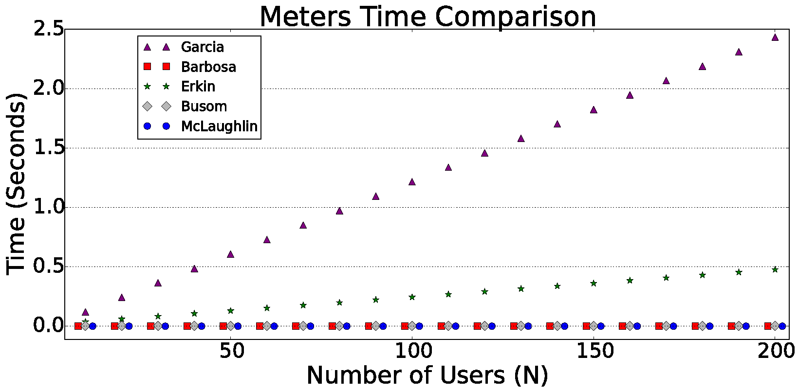

Figure 13: Processing time of smart meters in 5 different privacy preserving approaches.

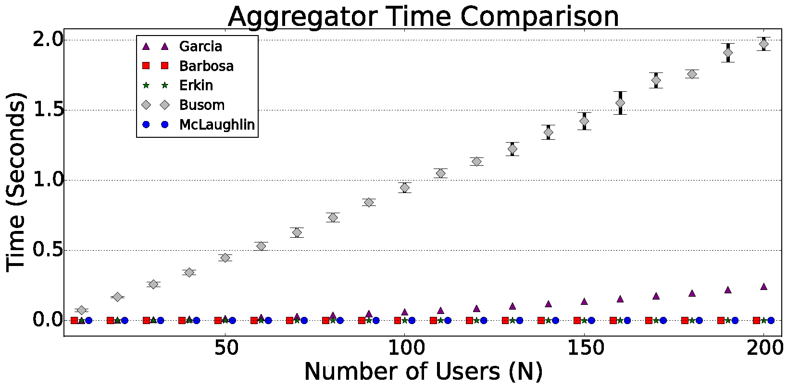

Figure 14: Processing time of the aggregator in 5 different privacy preserving approaches.

Each scenario was executed 10 times and the average values were considered. This amount of repetitions were enough to get precise average values. Due to the very low obtained variations, the confidence intervals are being omitted here, except for the aggregation in the approach proposed by Busom <em>et al</em>. (Busom et al. 2015), which needs a trial and error mechanism to solve the discrete logarithm problem. The confidence intervals in these cases are of 95%.

From these measurements, we conclude that the noise addition approach and the one that uses rechargeable batteries presented very low response times, whereas the homomorphic encryption approaches presented considerable delays. It is also important to note that there are many message exchanges in the homomorphic encryption approaches, but we are not considering possible network delays in our experiments.

<h4 id="cost-and-environmental-impact">Cost and Environmental Impact</h4>

As mentioned, usage of rechargeable batteries can help to diminish many privacy issues. Nevertheless, it is hard to ignore the environmental effects and the costs of using batteries. Mclaughlin <em>et al</em>. (McLaughlin, McDaniel, and Aiello 2011) stipulate that a lead-acid battery of 50 Ah which operates at 12 V may cost approximately $100, and to achieve a typical residential nominal voltage of 120 V it is required 10 of such batteries (aprox. $1,000). The lifetime of each battery is approximately two years. Therefore, these solutions can not be considered low cost and cause a high environmental impact. Noise addition and homomorphic encryption approaches do not have these limitations.

<h4 id="meters-independence-and-scalability">Meters’ Independence and Scalability</h4>

In order to exchange randomly generated numbers, keys and secret shares, the homomorphic encryption protocols require communication between meters and/or the power provider. Some solutions even require a large distribution of keys and certification. For this reason, in these approaches, the meters are not independent. This overhead can be the bottleneck of the smart metering system. Hence, actually optimizing communication at the meters is a hard task that has not been fully addressed in homomorphic encryption approaches. Additionally, if one meter fails in any message exchange, the aggregation may become impossible because it requires computations using all distributed keys or secret shares. Therefore, these solutions may raise scalability issues when used in an area with a large number of meters. Noise addition and rechargeable batteries approaches do not have these limitations.

<h4 id="accuracy">Accuracy</h4>

As mentioned, noise addition masks the data and introduces some error in an aggregation operation. This error is controlled and usually smaller than an acceptable value. Also, allowing the enabling or disabling of masking would make errors smaller in both dimensions: for billing, since a consumer would not mask all the time, and for load monitoring in a region, since not all consumers would mask in an instant of time. However, the noise addition privacy preserving approach is still not considered one hundred percent accurate. In the case of Section [sec:noise], the use of noise will introduce errors in the billing reports. These errors tend to be cancelled over time, but there is a probability that a higher value can occur. Rechargeable batteries and homomorphic encryption approaches do not have this limitation.

<h3 id="sec:discussionsmartmetering">Discussion</h3>

We reviewed five solutions, one based on the use of noise addition, other based on the use of rechargeable batteries and three others based on homomorphic encryption schemes. We evaluated these approaches considering the main needed performance aspects and conclude that each solution has its advantages and disadvantages, but the noise addition stands out with relation to the others. Therefore, we choose to implement the noise addition in the LiteMe system.

To validate the utility, many utilities or benefits that use metering data were listed and evaluated to check whether they are still supported when using masked data. Since the noise addition approach preserves the aggregated values, the procedure to check if a feature is supported can be mapped as a checking if the feature uses only aggregated values or also uses individual values.

Table [tab:utilities2] presents the list from Table [tab:utilities1] but with an additional column (supported or not). The check if a utility uses only aggregated values (and thus if it is supported) can be found in the references. From the features that are not supported, “load forecasting for individual consumers” and “individual data analytics” can be considered as privacy threats that were solved. Since the approach masks the profile using noise addition, the individual demand or consumption levels are not original and the feature “demand-based rates” is not supported. Therefore, if the power provider wants to use this feature, it will see this as a limitation.

c|c|c <strong>Feature / Benefit &amp;</strong>

<table>
<caption>Metering data utilities and the masking impact.</caption>
<tbody>
<tr class="odd">
<td align="left"><strong>Privacy</strong></td>
</tr>
<tr class="even">
<td align="left"><strong>Risk?</strong></td>
</tr>
</tbody>
</table>

&amp;<strong>Support 
Billing optimization (Barbosa et al. 2014) &amp; No &amp; 
Load monitoring and management for specific groups or regions (Barbosa et al. 2014) &amp; No &amp; 
Energy theft/losses detection (Anas et al. 2012) &amp; No &amp; 
Load forecasting for specific groups or regions (Ilić et al. 2013) &amp; No &amp; 
Load forecasting for individual consumers (Ilić et al. 2013) &amp; Yes &amp; 
Time-based rates (<em>e.g.</em>, different prices based on time of day and season) (Barbosa et al. 2014) &amp; No &amp; 
Demand-based rates (<em>e.g.</em> different prices based on demand levels) (Procel 2011) &amp; Yes &amp; 
Individual data analytics (<em>e.g.</em> <em>NIALM</em> and marketers) (Barbosa, Brito, and Almeida 2015; NIST 2014) &amp; Yes &amp; 
In-home feedback tools: estimated bills, device profiles etc (Ying-Xun et al. 2013) &amp; No &amp; 
</strong>

We implemented the noise addition approach as a privacy switch in the smart meter, as presented in Figure 15. There are many components in this sensor, however the most important ones are:

<ol>
<li>
<strong>ACS712</strong>: Hall-Effect-Based Linear Current Sensor. Able to measure <em>A</em><em>C</em>/<em>D</em><em>C</em> current up to 30<em>A</em>.
</li>
<li>
<strong>Switching power supply</strong>: Set as 220<em>V</em> input and 3.3<em>V</em> output - 1<em>A</em>.
</li>
<li>
<strong>CS5490</strong>: IC of power management. Two channels used for current and voltage. 4<em>k</em><em>H</em><em>z</em> sampling rate and 24 bit resolution. Calculates powers (active, reactive and apparent), power factor, peak and RMS values.
</li>
<li>
<strong>Voltage transformer</strong>: Set as 220<em>V</em> primary and 12<em>V</em> secondary.
</li>
<li>
<strong>ESP8266</strong>: WiFi module with memory (512<em>K</em><em>B</em> flash storage) and processing capacity (80<em>M</em><em>H</em><em>z</em> CPU), GPIOs and ADC converter (not being used).
</li>
<li>
<strong>Privacy switch</strong>: Allows enabling/disabling the data masking mechanism.
</li>
</ol>

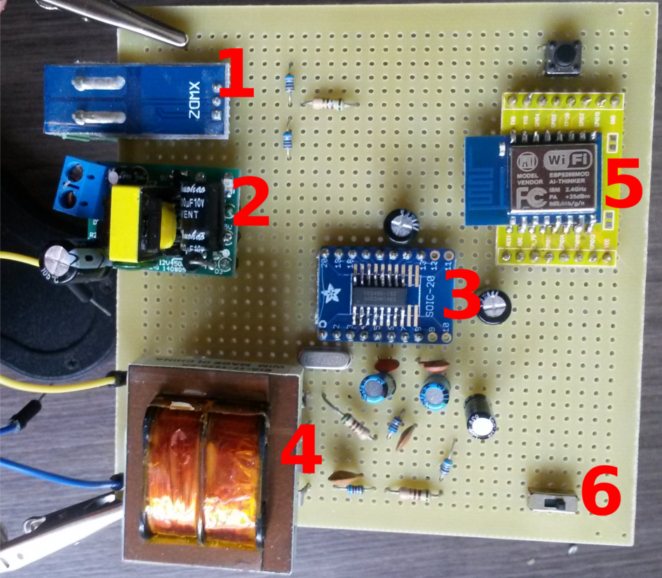

Figure 15: LiteMe sensor device.

Our focus here is the privacy switch (number 6). This privacy implementation is in accordance with the privacy definition mentioned by Stallings <em>et al</em>. (Stallings and Brawn 2015). When the switch is in the disabled position, the meter sends to the remote server the original power measurements. If the switch is in the enabled position, the meter sends to the remote server masked measurements. The pseudorandom number generator used in this implementation uses /<em>d</em><em>e</em><em>v</em>/<em>u</em><em>r</em><em>a</em><em>n</em><em>d</em><em>o</em><em>m</em>, which is considered cryptographically secure (“Myths about /dev/urandom” 2018).

The implementation of the noise addition technique consists in an evidence of privacy. Table [tab:e2smartmetering2] describes a sheet for this evidence <em>E</em>2. Since the evaluation and choice of the best evaluated techniques increase the confidence, we also have the evidence of privacy <em>E</em>3, regarding the comparison of the privacy techniques, as presented in Table [tab:e3smartmetering]. The implemented noise addition approach provides differential privacy for appliances, as described in Section [sec:noise]. Therefore, there is another evidence of privacy, <em>E</em>4, as described in the sheet of Table [tab:e4smartmetering].

p0.7cm|p7.5cm|p1.2cm|p2.2cm|p1.2cm

<table>
<caption>Sheet for the evidence <em>E</em>2. Implementation of the privacy technique of noise addition.</caption>
<tbody>
<tr class="odd">
<td align="left"><strong>E2</strong></td>
</tr>
</tbody>
</table>

&amp; &amp;

<table>
<caption>Sheet for the evidence <em>E</em>2. Implementation of the privacy technique of noise addition.</caption>
<tbody>
<tr class="odd">
<td align="left"><strong>Status</strong>:</td>
</tr>
<tr class="even">
<td align="left">Done</td>
</tr>
</tbody>
</table>

&amp;

<table>
<caption>Sheet for the evidence <em>E</em>2. Implementation of the privacy technique of noise addition.</caption>
<tbody>
<tr class="odd">
<td align="left"><strong>Review Date</strong>:</td>
</tr>
<tr class="even">
<td align="left">February 2015</td>
</tr>
</tbody>
</table>

&amp;

<table>
<caption>Sheet for the evidence <em>E</em>2. Implementation of the privacy technique of noise addition.</caption>
<tbody>
<tr class="odd">
<td align="left"><strong>Weight</strong>:</td>
</tr>
<tr class="even">
<td align="left">8</td>
</tr>
</tbody>
</table>

 
 
 
 
 

p0.6cm|p8.2cm|p1.2cm|p2.2cm|p1.2cm

<table>
<caption>Sheet for the evidence <em>E</em>3. Performance evaluation of different privacy techniques.</caption>
<tbody>
<tr class="odd">
<td align="left"><strong>E3</strong></td>
</tr>
</tbody>
</table>

&amp; &amp;

<table>
<caption>Sheet for the evidence <em>E</em>3. Performance evaluation of different privacy techniques.</caption>
<tbody>
<tr class="odd">
<td align="left"><strong>Status</strong>:</td>
</tr>
<tr class="even">
<td align="left">Done</td>
</tr>
</tbody>
</table>

&amp;

<table>
<caption>Sheet for the evidence <em>E</em>3. Performance evaluation of different privacy techniques.</caption>
<tbody>
<tr class="odd">
<td align="left"><strong>Review Date</strong>:</td>
</tr>
<tr class="even">
<td align="left">August 2015</td>
</tr>
</tbody>
</table>

&amp;

<table>
<caption>Sheet for the evidence <em>E</em>3. Performance evaluation of different privacy techniques.</caption>
<tbody>
<tr class="odd">
<td align="left"><strong>Weight</strong>:</td>
</tr>
<tr class="even">
<td align="left">2</td>
</tr>
</tbody>
</table>

 
 
 
 
 

p0.7cm|p7.5cm|p1.2cm|p2.2cm|p1.2cm

<table>
<caption>Sheet for the evidence <em>E</em>4. Differential privacy for appliance usages.</caption>
<tbody>
<tr class="odd">
<td align="left"><strong>E4</strong></td>
</tr>
</tbody>
</table>

&amp; &amp;

<table>
<caption>Sheet for the evidence <em>E</em>4. Differential privacy for appliance usages.</caption>
<tbody>
<tr class="odd">
<td align="left"><strong>Status</strong>:</td>
</tr>
<tr class="even">
<td align="left">Done</td>
</tr>
</tbody>
</table>

&amp;

<table>
<caption>Sheet for the evidence <em>E</em>4. Differential privacy for appliance usages.</caption>
<tbody>
<tr class="odd">
<td align="left"><strong>Review Date</strong>:</td>
</tr>
<tr class="even">
<td align="left">August 2015</td>
</tr>
</tbody>
</table>

&amp;

<table>
<caption>Sheet for the evidence <em>E</em>4. Differential privacy for appliance usages.</caption>
<tbody>
<tr class="odd">
<td align="left"><strong>Weight</strong>:</td>
</tr>
<tr class="even">
<td align="left">8</td>
</tr>
</tbody>
</table>

 
 
 
 
 

Figure 16 presents the third iteration of the construction of the <em>GSN</em> representation for this case study. The diagram now contains the representation of the evidences <em>E</em>2, <em>E</em>3 and <em>E</em>4.

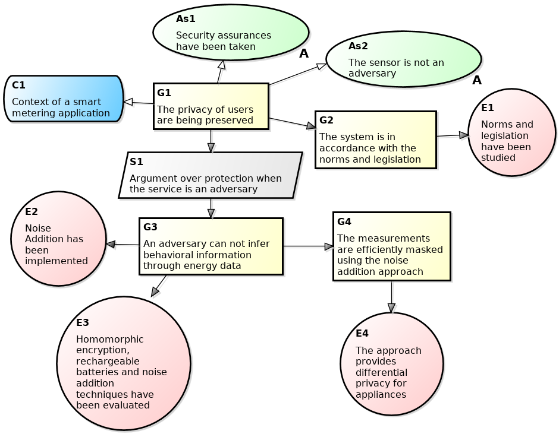

Figure 16: Third iteration of the construction of the <em>GSN</em> representation for the privacy case of a smart metering application.

<h2 id="potential-attacks">Potential Attacks</h2>

We evaluated three types of privacy attacks to the noise addition approach. The first is a filtering attack, based on the calculation of moving arithmetic means throughout the consumption profile. The second evaluated attack is a <em>Non-Intrusive Appliance Load Monitoring</em> (<em>NIALM</em>). Finally, the third attack is based on the hypothesis that a consumer tends to have a similar weekly behavior and, therefore, the attacker may collect the consumer’s data and calculate an expected week for this consumer.

<h3 id="sec:filtering"><em>Filtering Attack</em></h3>

In this section we present a filtering attack. It is based on the calculation of moving arithmetic means throughout the profile. The algorithm for the filtering attack works as follows:

<ul>
<li>
Let <em>T</em> be a time series, which represents the masked profile and <em>T</em><em>f</em> a new series (the resulting filtered profile).
</li>
<li>
The first <em>P</em> values from <em>T</em><em>f</em> will be equal to the first <em>P</em> values of <em>T</em> and the last <em>P</em> values from <em>T</em><em>f</em> will be equal to the last <em>P</em> values of <em>T</em>.
</li>
<li>
The value with index <em>P</em> + 1 from <em>T</em><em>f</em> will be the mean of the values with indexes from 1 to 2<em>P</em> + 1 from <em>T</em>. The value with index <em>P</em> + 2 will be the mean of the values with indexes from 2 to 2<em>P</em> + 2 from <em>T</em>, and so on for all remaining values. This procedure creates moveable means to eliminate the high-frequency noise.
</li>
</ul>

To analyze the attack effectiveness, we made experiments to verify if the Pearson correlation coefficient<a href="#fn10" class="footnoteRef" id="fnref10">10</a> between the original profile and the masked profile is increased after the filtering. For example, using the masked profile from Figure 10, we verified if the added noise is removed and if the correlation with the original profile is increased. As presented in Table [tab:Pvalues], we made this procedure using different <em>P</em> values. In this example, the configuration which presented best result was <em>P</em> = 30.

As observed in Table [tab:Pvalues], the effectiveness of filtering is increased when we increment the <em>P</em> value because the high frequency noise is increasingly eliminated. In fact, the correlation between the masked profile and the original profile is 0.2135, whereas filtering with <em>P</em> = 30 we obtain a correlation of 0.7368. In other words, we can consider that this attack has some effect on privacy. However, the attacker may not know which <em>P</em> value to choose and if the chosen one is greater than 30, the obtained correlation is dwindled due the filtering saturation. In this example, choosing <em>P</em> values greater than 30, the filter will eliminate not only the added noise, but also the original characteristics of the profile.

M0.1M0.2||M0.1M0.2 <strong>P &amp; <strong>Correlation &amp; <strong>P &amp; <strong>Correlation 
0 &amp; 0.2135 &amp; 29 &amp; 0.7363 
2 &amp; 0.4154 &amp; 30 &amp; 0.7368 
4 &amp; 0.5101 &amp; 31 &amp; 0.7362 
8 &amp; 0.6149 &amp; 32 &amp; 0.7351 
16 &amp; 0.6859 &amp; 256 &amp; 0.4164 
</strong></strong></strong></strong>

Experiments also showed that coarse-grained measurements (with longer time intervals) implies less filtering efficiency. This is because each measurement becomes less correlated with the adjacent measurements. For the same consumer of the previous example, the Figure 17 presents the mean of the best values of <em>P</em> (vertical axis) for different granularity of measurements (horizontal axis). As observed for this consumer, using measurement intervals of 36 minutes (or greater) will make filtering attacks ineffective because the best setting is using a <em>P</em> equals to 0 (<em>i.e</em>, no filtering). This means that with a granularity greater than or equals to 36 minutes, the original profile is more correlated with the masked profile than with the filtered profile. Therefore, after evaluating the experimental results of the filtering attack, we considered this attack as unsuccessful, and we have the evidence of privacy <em>E</em>5, as presented in the sheet of Table [tab:e5smartmetering].

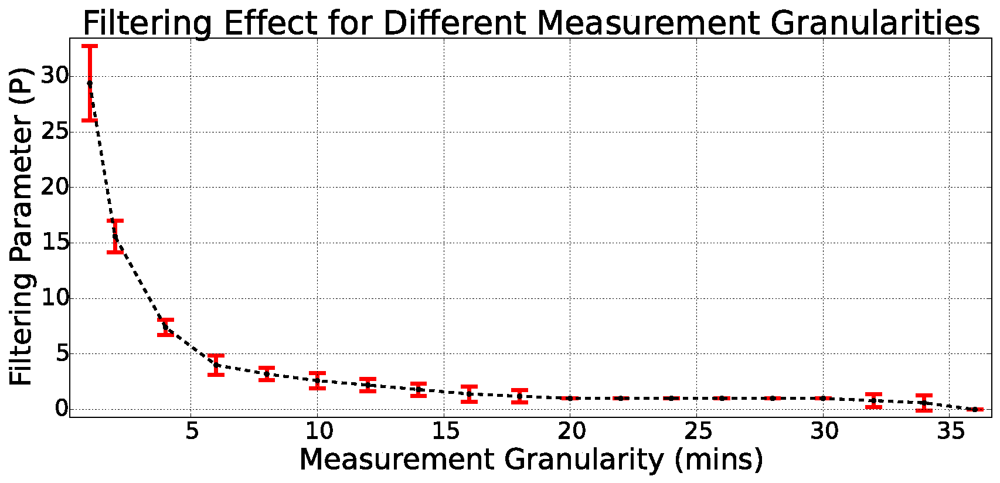

Figure 17: Filtering parameter (<em>P</em>) for different measurement granularities. The confidence intervals are of 95%.

p0.7cm|p7.5cm|p1.2cm|p2.2cm|p1.2cm

<table>
<caption>Sheet for the evidence <em>E</em>5. Resilience to the filtering attack.</caption>
<tbody>
<tr class="odd">
<td align="left"><strong>E5</strong></td>
</tr>
</tbody>
</table>

&amp; &amp;

<table>
<caption>Sheet for the evidence <em>E</em>5. Resilience to the filtering attack.</caption>
<tbody>
<tr class="odd">
<td align="left"><strong>Status</strong>:</td>
</tr>
<tr class="even">
<td align="left">Done</td>
</tr>
</tbody>
</table>

&amp;

<table>
<caption>Sheet for the evidence <em>E</em>5. Resilience to the filtering attack.</caption>
<tbody>
<tr class="odd">
<td align="left"><strong>Review Date</strong>:</td>
</tr>
<tr class="even">
<td align="left">June 2015</td>
</tr>
</tbody>
</table>

&amp;

<table>
<caption>Sheet for the evidence <em>E</em>5. Resilience to the filtering attack.</caption>
<tbody>
<tr class="odd">
<td align="left"><strong>Weight</strong>:</td>
</tr>
<tr class="even">
<td align="left">3</td>
</tr>
</tbody>
</table>

 
 
 
 
 

<h3 id="sec:nialm"><em>NIALM</em></h3>

We also performed some <em>NIALM</em> attacks and the results were evaluated. Figure 18 presents the workflow of this testing procedure. The noise addition approach is applied in the green task, whereas in the orange boxes, we applied the Improved <em>NIALM</em> using <em>load DIvision and Calibration</em> (<em>INDIC</em>) algorithm (Batra, Dutta, and Singh 2013).

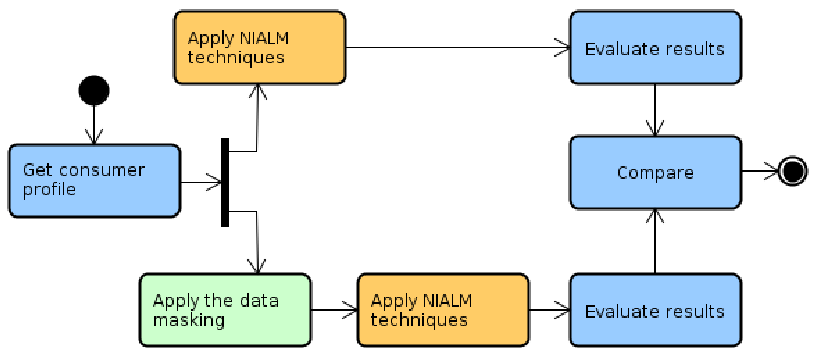

Figure 18: Workflow for privacy validation through <em>NIALM</em> attacks.

Figure 19 presents a weekly profile obtained from the popular <em>REDD</em> dataset (Kolter and Johnson 2011). In this profile, there are many appliances being used, such as a microwave and a refrigerator. Figure 20 presents the real disaggregated microwave profile. A microwave was chosen as an example because in this profile it is a very characteristic appliance and one of the most difficult to be hidden (since it has many peak variations).

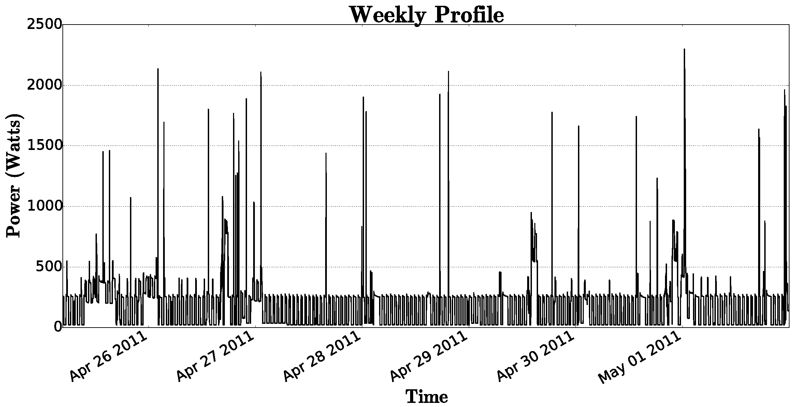

Figure 19: Example week obtained from the <em>REDD</em> dataset (measurements are at each 1 minute).

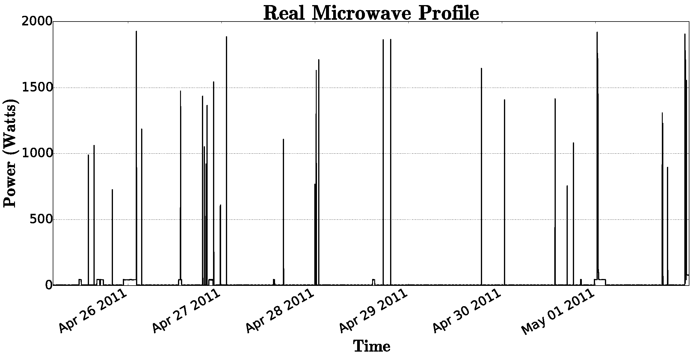

Figure 20: Real disaggregated microwave obtained from profile of Figure 19.

After applying the <em>INDIC</em> algorithm to perform <em>NIALM</em> on the profile from Figure 19, the appliances were disaggregated. Figure 21 presents the predicted microwave profile. As observed, this predicted profile is very similar with the real microwave profile (at least the peak moments and levels are almost the same).

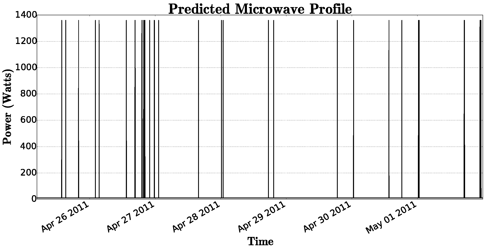

Figure 21: Disaggregated microwave predicted by <em>INDIC</em> over profile of Figure 19.

We applied our noise addition approach and using an allowed error of (<em>e</em><em>a</em>) of 5% to mask the aggregated profile from Figure 19, the masked profile from Figure 22 was obtained. Because negative demand values are impossible and <em>NIALM</em> tools can not work with that, we vertically shifted the profile to perform the <em>NIALM</em> attack. This modification was simply the addition of the absolute minimum value to every measurement of the profile, i.e., ∀<em>c</em> ∈ <em>P</em>, we made <em>c</em> = <em>c</em> + |<em>m</em><em>i</em><em>n</em>(<em>P</em>)|, where <em>P</em> is the profile and <em>c</em> is an individual measurement. For the <em>NIALM</em> algorithm, this procedure should be the same as considering that an appliance which demands |<em>m</em><em>i</em><em>n</em>(<em>P</em>)| was always on usage.

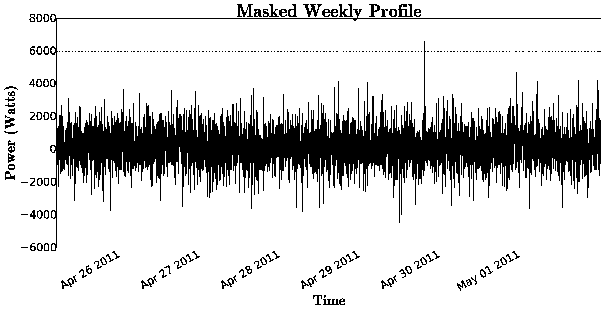

Figure 22: Aggregated profile of Figure 19 masked using <em>e</em><em>a</em> of 5%.

After applying the same <em>INDIC</em> algorithm to perform the <em>NIALM</em>, we observed that the technique lost significantly its ability to detect appliance usages. Figure 23 presents the predicted microwave profile by the <em>INDIC</em> algorithm applied on the masked profile from Figure 22.

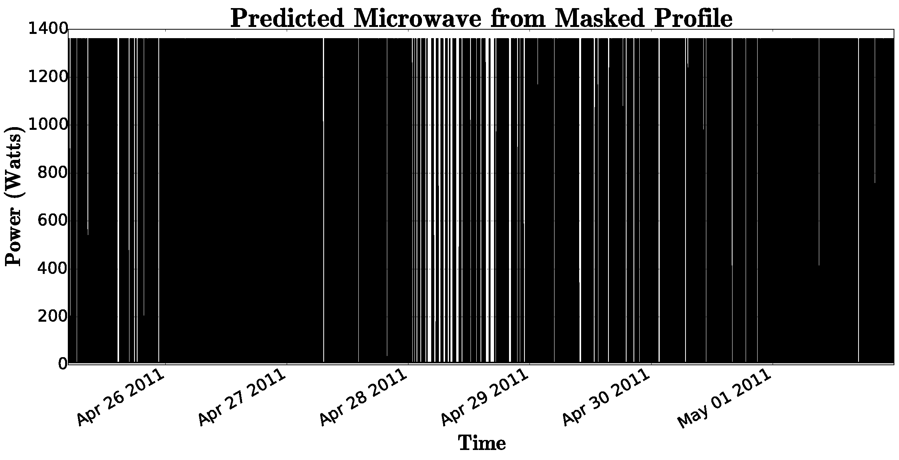

Figure 23: Disaggregated microwave predicted by <em>INDIC</em> over the masked profile of Figure 22.

To evaluate the potential of <em>NIALM</em> approaches in detecting appliance usages, Batra <em>et al.</em> (Batra, Dutta, and Singh 2013) use two metrics: <em>Mean Normalized Error</em> (<em>MNE</em>) and <em>Root Mean Square Error</em> (<em>RMS</em>). Lower values of <em>MNE</em> and <em>RMS</em> imply in better accuracy of the <em>NIALM</em>. Using different configurations, we evaluated the masking approach for the two most significant appliances of the profile from Figure 19, as presented in Table [tab:indicMNE] and Table [tab:indicRMS]. As observed, even using a high utility level and a low obfuscation (choosing a small <em>e</em><em>a</em>), the noise addition approach still affects significantly the <em>NIALM</em> potential to detect appliance usages (the <em>MNE</em> and <em>RMS</em> values are increased significantly). Therefore, we consider this attack as unsuccessful, and we have the evidence of privacy <em>E</em>6, as presented in the sheet of Table [tab:e6smartmetering].

<table>
<caption><em>MNE</em> values by <em>INDIC</em> using different masking configurations (no masking, masking with allowed error of 1%, 2% and 5%).</caption>
<tbody>
<tr class="odd">
<td align="center"><strong>Appliance &amp; <strong>No Masking &amp; <em>e</em><em>a</em> = 1% &amp; <em>e</em><em>a</em> = 2% &amp; <em>e</em><em>a</em> = 5% 
Microwave &amp; 70.89 &amp; 225.69 &amp; 2976.94 &amp; 6768.89 
Refrigerator &amp; 28.09 &amp; 248.31 &amp; 247.59 &amp; 278.4 
</strong></strong></td>
<td align="center"></td>
<td align="center"></td>
<td align="center"></td>
<td align="center"></td>
</tr>
</tbody>
</table>

<table>
<caption><em>RMS</em> values by <em>INDIC</em> using different masking configurations (no masking, masking with allowed error of 1%, 2% and 5%).</caption>
<tbody>
<tr class="odd">
<td align="center"><strong>Appliance &amp; <strong>No Masking &amp;<em>e</em><em>a</em> = 1% &amp; <em>e</em><em>a</em> = 2% &amp; <em>e</em><em>a</em> = 5% 
Microwave &amp; 54.16 &amp; 193.47 &amp; 649.45 &amp; 495.72 
Refrigerator &amp; 70.17 &amp; 143.34 &amp; 216.79 &amp; 189.67 
</strong></strong></td>
<td align="center"></td>
<td align="center"></td>
<td align="center"></td>
<td align="center"></td>
</tr>
</tbody>
</table>

p0.7cm|p7.5cm|p1.2cm|p2.2cm|p1.2cm

<table>
<caption>Sheet for the evidence <em>E</em>6. Resilience to the <em>NIALM</em> attack.</caption>
<tbody>
<tr class="odd">
<td align="left"><strong>E6</strong></td>
</tr>
</tbody>
</table>

&amp; &amp;

<table>
<caption>Sheet for the evidence <em>E</em>6. Resilience to the <em>NIALM</em> attack.</caption>
<tbody>
<tr class="odd">
<td align="left"><strong>Status</strong>:</td>
</tr>
<tr class="even">
<td align="left">Done</td>
</tr>
</tbody>
</table>

&amp;

<table>
<caption>Sheet for the evidence <em>E</em>6. Resilience to the <em>NIALM</em> attack.</caption>
<tbody>
<tr class="odd">
<td align="left"><strong>Review Date</strong>:</td>
</tr>
<tr class="even">
<td align="left">June 2015</td>
</tr>
</tbody>
</table>

&amp;

<table>
<caption>Sheet for the evidence <em>E</em>6. Resilience to the <em>NIALM</em> attack.</caption>
<tbody>
<tr class="odd">
<td align="left"><strong>Weight</strong>:</td>
</tr>
<tr class="even">
<td align="left">3</td>
</tr>
</tbody>
</table>

 
 
 
 
 

<h3 id="sec:weeklybehavior"><em>Weekly Behavior Attack</em></h3>

This attack is based on the hypothesis that the consumer tends to have a similar weekly behavior (expected week). An expected week is composed by the seven expected days (from Sunday to Saturday), and an expected day is composed by the averages of each instant of time from this specific day (<em>e.g.</em>, the attacker calculates the expected Sunday from all available Sundays). Using the expected week, the attacker can try to predict the consumer behavior in future weeks. The attack effect is dependent on the amount of data available to the attacker.

From the CER dataset (real residential consumers of Ireland), we selected a consumer who always repeats his/her behavior and considered in our experiments. The results are presented in Table [tab:weeklybehavior]. The average Pearson correlation between masked weeks and real weeks was compared versus the average Pearson correlation between the expected week and real weeks to analyze the attack effect. We used confidence intervals with significance levels of 95%.

As it can be seen in Table [tab:weeklybehavior], when the number of weeks available to the attacker increases, the attack effect increases also, because the correlation between the expected week and real weeks is higher. But for our experiments, even choosing a consumer who repeats a behavior almost always and using a long period of observation (52 weeks or a full year), these correlations are less than the correlations between masked weeks and real weeks. It means that it is better to guess the consumer behavior from the own masked week than from the expected week. Therefore, we considered this attack as unsuccessful, and we have the evidence of privacy <em>E</em>7, as presented in the sheet of Table [tab:e7smartmetering].

<table>
<caption>Effect of the attack of the similar weekly behavior for a residential consumer.</caption>
<tbody>
<tr class="odd">
<td align="center"><strong>Number of available</strong></td>
<td align="center"><strong>Average correlation between</strong></td>
<td align="center"><strong>Average correlation between</strong></td>
</tr>
<tr class="even">
<td align="center"><strong>weeks to the attacker</strong></td>
<td align="center"><strong>masked and real weeks</strong></td>
<td align="center"><strong>the expected and real weeks</strong></td>
</tr>
<tr class="odd">
<td align="center">2</td>
<td align="center">(0,499; 0,510)</td>
<td align="center">(-0,046; -0,033)</td>
</tr>
<tr class="even">
<td align="center">4</td>
<td align="center">(0,335; 0,344)</td>
<td align="center">(-0,005; 0,004)</td>
</tr>
<tr class="odd">
<td align="center">8</td>
<td align="center">(0,369; 0,374)</td>
<td align="center">(0,154; 0,166)</td>
</tr>
<tr class="even">
<td align="center">16</td>
<td align="center">(0,326; 0,331)</td>
<td align="center">(0,171; 0,180)</td>
</tr>
<tr class="odd">
<td align="center">32</td>
<td align="center">(0,436; 0,439)</td>
<td align="center">(0,182; 0,189)</td>
</tr>
<tr class="even">
<td align="center">52</td>
<td align="center">(0,432; 0,434)</td>
<td align="center">(0,316; 0,323)</td>
</tr>
</tbody>
</table>

p0.7cm|p7.5cm|p1.2cm|p2.2cm|p1.2cm

<table>
<caption>Sheet for the evidence <em>E</em>7. Resilience to the similar weekly behavior attack.</caption>
<tbody>
<tr class="odd">
<td align="left"><strong>E7</strong></td>
</tr>
</tbody>
</table>

&amp; &amp;

<table>
<caption>Sheet for the evidence <em>E</em>7. Resilience to the similar weekly behavior attack.</caption>
<tbody>
<tr class="odd">
<td align="left"><strong>Status</strong>:</td>
</tr>
<tr class="even">
<td align="left">Done</td>
</tr>
</tbody>
</table>

&amp;

<table>
<caption>Sheet for the evidence <em>E</em>7. Resilience to the similar weekly behavior attack.</caption>
<tbody>
<tr class="odd">
<td align="left"><strong>Review Date</strong>:</td>
</tr>
<tr class="even">
<td align="left">June 2015</td>
</tr>
</tbody>
</table>

&amp;

<table>
<caption>Sheet for the evidence <em>E</em>7. Resilience to the similar weekly behavior attack.</caption>
<tbody>
<tr class="odd">
<td align="left"><strong>Weight</strong>:</td>
</tr>
<tr class="even">
<td align="left">3</td>
</tr>
</tbody>
</table>

 
 
 
 
 

After performing the attacks and providing the evidences <em>E</em>5, <em>E</em>6 and <em>E</em>7, the <em>GSN</em> representation was expanded to the one presented in Figure 24.

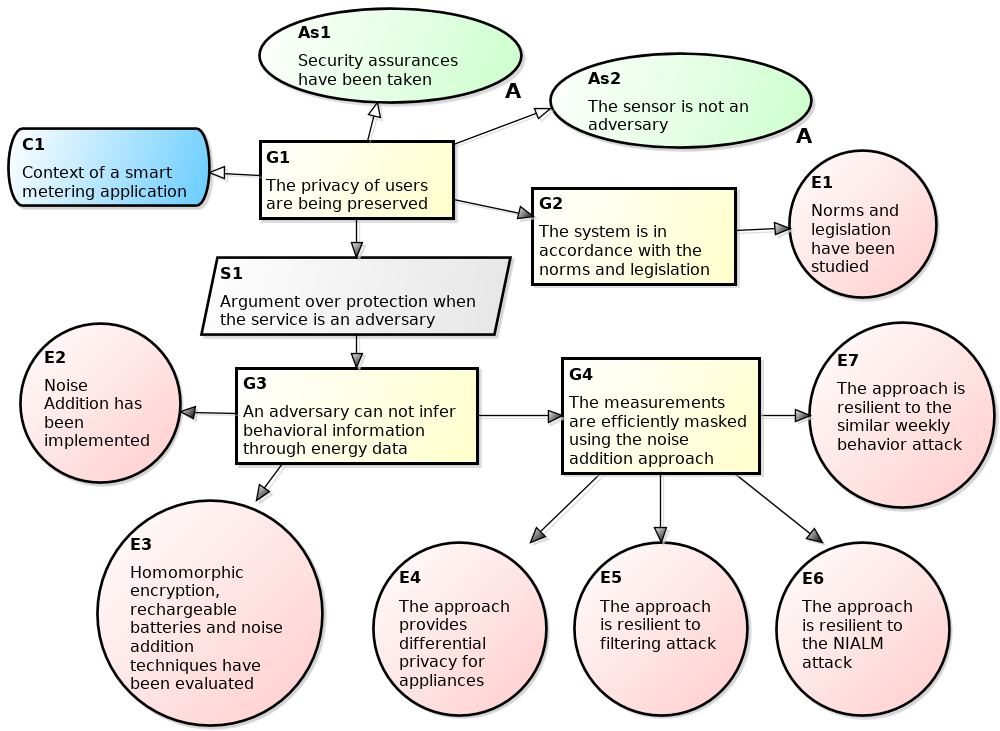

Figure 24: Fourth iteration of the construction of the <em>GSN</em> representation for the privacy case of a smart metering application.

<h2 id="concluding-remarks">Concluding Remarks</h2>

We validated the <em>Privacy by Evidence</em> (<em>PbE</em>) methodology through a case study of a smart metering application. Table [tab:checklistsmartmetering] shows the checklist with the collected artifacts in this case study.

<table>
<caption>Checklist of the artifacts produced in the smart metering case study.</caption>
<tbody>
<tr class="odd">
<td align="left"></td>
<td align="left">Engagement Report</td>
<td align="center"></td>
</tr>
<tr class="even">
<td align="left"></td>
<td align="left">Datasets</td>
<td align="center"></td>
</tr>
<tr class="odd">
<td align="left"></td>
<td align="left">Summary of Norms</td>
<td align="center"></td>
</tr>
<tr class="even">
<td align="left"></td>
<td align="left">Implementation of Norms</td>
<td align="center"></td>
</tr>
<tr class="odd">
<td align="left"></td>
<td align="left">Compliance Proofs</td>
<td align="center"></td>
</tr>
<tr class="even">
<td align="left"></td>
<td align="left">Utilities List</td>
<td align="center"></td>
</tr>
<tr class="odd">
<td align="left"></td>
<td align="left">Perception Questionnaires</td>
<td align="center"></td>
</tr>
<tr class="even">
<td align="left"></td>
<td align="left">Perception Report</td>
<td align="center"></td>
</tr>
<tr class="odd">
<td align="left"></td>
<td align="left">Privacy Concerns</td>
<td align="center"></td>
</tr>
<tr class="even">
<td align="left"></td>
<td align="left">Adversary Model</td>
<td align="center"></td>
</tr>
<tr class="odd">
<td align="left"></td>
<td align="left">Privacy Policy</td>
<td align="center"></td>
</tr>
<tr class="even">
<td align="left"></td>
<td align="left">Summary of Techniques</td>
<td align="center"></td>
</tr>
<tr class="odd">
<td align="left"></td>
<td align="left">Techniques Report</td>
<td align="center"></td>
</tr>
<tr class="even">
<td align="left"></td>
<td align="left">Implementation of Techniques</td>
<td align="center"></td>
</tr>
<tr class="odd">
<td align="left"></td>
<td align="left">New Utilities List</td>
<td align="center"></td>
</tr>
<tr class="even">
<td align="left"></td>
<td align="left">Summary of Attacks</td>
<td align="center"></td>
</tr>
<tr class="odd">
<td align="left"></td>
<td align="left">Attack Scripts</td>
<td align="center"></td>
</tr>
<tr class="even">
<td align="left"></td>
<td align="left">Attacks Report</td>
<td align="center"></td>
</tr>
</tbody>
</table>

Figure 24 presented the <em>GSN</em> for the privacy case of a smart metering application considering the mentioned adversary model. This representation is still to grow, according to the normal software evolution and our proposed methodology. In this application context, assuming that security assurances have been taken and thay the sensor is not an adversary, there is an argument that the privacy is being preserved according to the provided evidences. Every evidence has an identification to enable the traceability into the corresponding artifacts. There are other smart energy meter solutions such as OPower<a href="#fn11" class="footnoteRef" id="fnref11">11</a> and Eyedro<a href="#fn12" class="footnoteRef" id="fnref12">12</a>, however, we claim that LiteMe is the first application to consider techniques to preserve users’ privacy.

After validating the <em>Privacy by Evidence</em> (<em>PbE</em>) through a case study of a smart metering application, we conclude that this methodology can be regarded as an effective way to implement privacy protections mechanism. Seven privacy evidences were provided and the sum of their weights results in 28. Therefore, we positively support the research question <em>R</em><em>Q</em>1. It is important to note that such mitigations must be an iterative work, and thus the stages in the methodology must happen in a constant cycle, once new risks can always be detected.

<ol>
<li id="fn1">
<a href="http://liteme.com.br" class="uri">http://liteme.com.br</a><a href="#fnref1">↩</a>
</li>
<li id="fn2">
<a href="http://www.smartiks.com" class="uri">http://www.smartiks.com</a><a href="#fnref2">↩</a>
</li>
<li id="fn3">
Combining appliance signatures it is possible to generate arbitrary large populations and measurement frequency. Several databases of appliance signatures are available online (<em>e.g.</em>, Tracebase (Reinhardt et al. 2012)).<a href="#fnref3">↩</a>
</li>
<li id="fn4">
ANEEL, Normative Resolution No 502, Chapter III, Art. 7. <a href="www.aneel.gov.br/cedoc/ren2012502.pdf" class="uri">www.aneel.gov.br/cedoc/ren2012502.pdf</a><a href="#fnref4">↩</a>
</li>
<li id="fn5">
ANEEL, PRODIST, Module 5, Section 4.1.3.1. <a href="www.aneel.gov.br/arquivos/PDF/Modulo5_Revisao_2.pdf" class="uri">www.aneel.gov.br/arquivos/PDF/Modulo5_Revisao_2.pdf</a><a href="#fnref5">↩</a>
</li>
<li id="fn6">
The source codes can be found at our GitHub repository (<a href="https://git.lsd.ufcg.edu.br/pedroysb/privacy-performance-smart-metering/tree/master" class="uri">https://git.lsd.ufcg.edu.br/pedroysb/privacy-performance-smart-metering/tree/master</a>).<a href="#fnref6">↩</a>
</li>
<li id="fn7">
<em>libgmp</em>: <a href="https://gmplib.org" class="uri">https://gmplib.org</a><a href="#fnref7">↩</a>
</li>
<li id="fn8">
<em>libpaillier</em>: <a href="http://acsc.cs.utexas.edu/libpaillier" class="uri">http://acsc.cs.utexas.edu/libpaillier</a><a href="#fnref8">↩</a>
</li>
<li id="fn9">
<em>libcrypto</em>: <a href="https://www.openssl.org/docs/manmaster/crypto/crypto.html" class="uri">https://www.openssl.org/docs/manmaster/crypto/crypto.html</a><a href="#fnref9">↩</a>
</li>
<li id="fn10">
The Pearson correlation coefficient is a measure of the linear dependence between two variables. It has a value between +1 and -1 inclusive, where 1 is total positive linear correlation, 0 is no linear correlation, and -1 is total negative linear correlation.<a href="#fnref10">↩</a>
</li>
<li id="fn11">
Opower, opower.com<a href="#fnref11">↩</a>
</li>
<li id="fn12">
Eyedro, eyedro.com<a href="#fnref12">↩</a>
</li>
</ol>

[Back to index](https://pedroysb.github.io/Privacy-by-Evidence)
