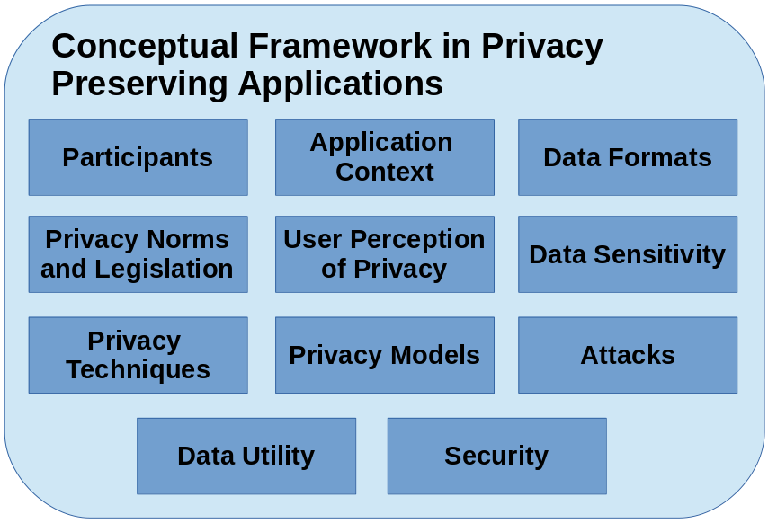
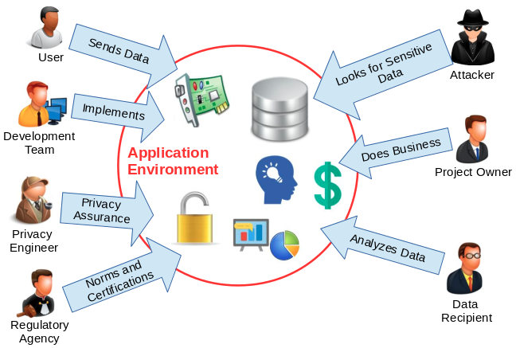

[Back to index](https://pedroysb.github.io/Privacy-by-Evidence)

# Conceptual Framework

In this section we describe the key concepts when dealing with privacy. The goal is to generate a manageable knowledge that is used in our proposed methodology. The conceptual framework with the key concepts identified by us is presented in Figure [fig:conceptualFramework]. We describe these concepts in the next sections.

Key concepts when dealing with privacy.

<h2 id="participants">Participants</h2>

Figure [fig:participants] presents the possible participants/stakeholders in a typical scenario when developing a privacy-friendly application. They are:

<ul>
<li>
<em>User</em>: The user of the application. Software and sensors may collect sensitive data from the user and transmit to remote servers.
</li>
<li>
<em>Product Owner</em>: Entity that represents the executives. Initiates the project, finances it, contracts it out, and benefits from its output(s). Part of an owner responsibility is to have a vision of the requirements, and convey that vision to the development team.
</li>
<li>
<em>Development Team</em>: Responsible for developing and delivering the project in accordance to the requirements (including data privacy and utility requirements).
</li>
<li>
<em>Regulatory Agency</em>: Responsible for exercising autonomous authority and establishing privacy guidelines and rules. These preventive rules combined with penalty mechanisms can help preventing potentially dangerous activities.
</li>
<li>
<em>Privacy Engineer</em>: Responsible for risk analysis, development and evaluation of privacy techniques, provision of evidences, simulation of attacks and assurance that the privacy norms established by the regulatory agencies are being followed.
</li>
<li>
<em>Adversary</em>: Entity which seeks to violate the users privacy obtaining sensitive information. May perform many attacks depending on the application context, data format and privacy techniques.
</li>
<li>
<em>Data Recipient</em>: Third party who is interested in the published data and may conduct data analysis in sensitive data.
</li>
</ul>

Possible participants when developing a privacy-friendly application.

The application environment contains the building blocks of the system, such as sensors, servers, service APIs and databases. It may collect the data from users and publish to third parties or the public. A typical scenario of data collection and publishing is, for example, in health care. Through smart health devices, a hospital collects data from patients and publishes these records to an external medical center. In this example, the devices and the hospital are in the application environment, patients are users, and the medical center is the data recipient. The data analysis conducted at the medical center could be any task from a simple count of the number of men with diabetes to a sophisticated cluster analysis to make health insurances more profitable.

An adversary model may consider that the data recipient is untrusted. If the environment is trusted and users are willing to provide their personal information, there may be still a problem if the trust is transitive, <em>i.e.</em>, the data recipient be untrusted. In practice, different contexts may have different adversary assumptions and requirements.

<h2 id="application-context">Application Context</h2>

In different application contexts, the privacy and utility requirements may differ. Smart energy meters, social networks, geolocation systems, finance, and medical applications are some examples of application contexts. The identification of the context is essential, since different utilities can be provided when processing the data. More importantly, different application contexts can be target of different attacks and privacy violations, and therefore, the usage of different privacy protection techniques is required.

<h2 id="data-format">Data Format</h2>

In order to provide their features more precisely and specific for each individual, applications may collect large amounts of data. This data can exist in different formats; table records, time series, network traffic, graphs, text, images, among many others. The format in which the data is presented usually is related to the application context and different privacy protection techniques may be applied to different data formats.

<h2 id="data-sensitivity">Data Sensitivity</h2>

In the most basic form, a data unit may be or contain one of the following:

<ul>
<li>
<strong>Explicit Identifier</strong>: Set of attributes, such as name, email, phone number and IP address, containing information that explicitly identifies users.
</li>
<li>
<strong>Quasi Identifier</strong>: Set of attributes that could potentially identify users such as ZIP code, sex and date of birth. We call <em>Q</em><em>I</em><em>D</em> the set of attributes and <em>q</em><em>i</em><em>d</em> the values of this set.
</li>
<li>
<strong>Sensitive</strong>: Consist of sensitive person-specific information such as disease, energy consumption, salary, and disability status.
</li>
<li>
<strong>Non-Sensitive</strong>: Consist of all information that do not fall into the previous three categories.
</li>
</ul>

More importantly, the sensitive data also possess different sensitivity levels (<em>e.g.</em>, low, medium and high). There are some standards of classification of sensitive data (Stweart, Chapple, and Gibson 2015), however, in practice, the classification depends on the context and population. Improper collection and usage of sensitive data may be a privacy violation.

<h2 id="sec:norms">Privacy Norms and Legislation</h2>

Establishing norms to restrict the usage of sensitive data is one of the preventive methods for privacy protection. Preventive norms combined with punishing mechanisms (such as reporting violations to authorities) can help preventing potentially dangerous activities. Many regulatory agencies have proposed privacy norms that must be followed.

As an example, the <em>HIPAA</em> (<em>Health Insurance Portability and Accountability Act</em>) (<em>Guidance Regarding Methods for De-identification of Protected Health Information in Accordance with The Health Insurance Portability and Accountability Act (HIPAA), Privacy Rule</em> 2012) established the <em>Safe Harbor</em> standard, which is a precise method for anonymization of health information. It stipulates the removal or generalization of 18 variables from a data set:

<ol>
<li>
Names;
</li>
<li>
All geographic subdivisions smaller than a state, including street address, city, county, precinct, ZIP code, and their equivalent geocodes, except for the initial three digits of a ZIP code if, according to the current publicly available data from the Bureau of the Census:

<ol style="list-style-type: lower-alpha">
<li>
The geographic unit formed by combining all ZIP codes with the same three initial digits contains more than 20,000 people.
</li>
<li>
The initial three digits of a ZIP code for all such geographic units containing 20,000 or fewer people is changed to 000.
</li>
</ol></li>
<li>
All elements of dates (except year) for dates directly related to an individual, including birth date, admission date, discharge date, and date of death; and all ages over 89 and all elements of dates (including year) indicative of such age, except that such ages and elements may be aggregated into a single category of age 90 or older;
</li>
<li>
Telephone numbers;
</li>
<li>
Fax numbers;
</li>
<li>
Electronic mail addresses;
</li>
<li>
Social security numbers;
</li>
<li>
Medical record numbers;
</li>
<li>
Health plan beneficiary numbers;
</li>
<li>
Account numbers;
</li>
<li>
Certificate/ license numbers;
</li>
<li>
Vehicle identifiers and serial numbers, including license plate numbers;
</li>
<li>
Device identifiers and serial numbers;
</li>
<li>
Web universal resource locators (URLs);
</li>
<li>
Internet protocol (IP) address numbers;
</li>
<li>
Biometric identifiers, including finger and voice prints;
</li>
<li>
Full face photographic images and any comparable images;
</li>
<li>
Any other unique identifying number, characteristic, or code.
</li>
</ol>

The certainty and simplicity of <em>Safe Harbor</em> makes it quite attractive for health information custodians when disclosing data without patient consent, and it is used quite often in practice (Emam 2013).

Another regulation is the <em>GDPR</em> (<em>General Data Protection Regulation</em>) (“The EU General Data Protection Regulation (GDPR)” 2018), which became enforceable in the European Union on 25 May 2018. The aim of the <em>GDPR</em> is to “protect all European citizens from privacy and data breaches”, and has the following key points:

<ul>
<li>
<em>Territorial Scope</em>: The <em>GDPR</em> applies to the processing of personal data of Europen ciyizens by controllers and processors, regardless their locations;
</li>
<li>
<em>Penalties</em>: Organizations in breach of <em>GDPR</em> can be imposed for the infringements;
</li>
<li>
<em>Consent</em>: Users consent must be clear and distinguishable from other matters and provided in an intelligible and easily accessible form, using clear and plain language.
</li>
</ul>

Beyond the key points, <em>GDPR</em> stipulates <em>Privacy by Design</em> as a legal requirement during the development, and the European citizens have the following rights: the right to be notified when a data breach occurs, the right to access their data (and in a portable format), the right to be forgotten, and the right to restriction of processing.

Unfortunately, norms or regulations such as <em>GDPR</em> and <em>HIPAA</em> usually are not enough to guide developers in developing privacy-friendly applications. This is why the provision of concrete evidences of privacy and the implementation of other counter-measures such as conducting privacy perception studies, implementing privacy techniques, and evaluating potential attacks, become necessary.

<h2 id="users-perception-of-privacy">Users Perception of Privacy</h2>

Different people usually exhibit different perceptions of privacy, <em>i.e.</em>, they associate the word privacy with a diversity of meanings. For example, some people believe that privacy is the right to control what information about them may be made public (Mekovec 2010; Yao, Rice, and Wallis 2007). Other people believe that if someone cares about privacy is because he/she is involved in wrongdoing (Beckwith 2003).

Different perceptions of privacy originate different types of concerns about privacy. For example, some people tend to provide the information requested by the system only if it presents a privacy policy. Privacy policy is a legal document and software artifact that fulfills a legal requirement to protect the user privacy. It answers important questions about the software’s operation, including what personal identifiable information is collected, for what purpose is it used, and with whom is it shared (Bhatia, Breaux, and Schaub 2016).

The application of surveys and/or the conduction of interviews may cover and help to understand many privacy aspects, such as: (i) general perceptions, beliefs and attitudes; (ii) perceptions about data collection and control; (iii) perceptions about information inference; (iv) perception about information usage; and (v) perceptions about possibilities of data exchange (not only leakage) (Ponciano et al. 2017).

<h2 id="sec:techniques">Privacy Techniques</h2>

The raw data usually does not satisfy specified privacy requirements and it must be modified before the disclosure. The modification is done by applying privacy techniques which may come in several flavors, like anonymization (Dalenius 1986), generalization (Sweeney 2002), noise addition (Barbosa et al. 2014), zero-knowledge proofs (Gehrke, Lui, and Pass 2011) and the usage of homomorphic encryption (Lauter, Naehrig, and Vaikuntanathan 2011). As an example, anonymization refers to the approach that seeks to hide the identity of users, assuming that sensitive data must be retained for data analysis. Clearly, explicit identifiers of users must be removed.

Several techniques may work for the same context and data format. The objective of such techniques is to protect sensitive user data from possible privacy violations. It may also include the provision of the control of what information may be disclosed to the service, data recipients or other users.

<h2 id="attacks">Attacks</h2>

A privacy attack is an attempt to expose, steal or gain unauthorized access to sensitive data. Unfortunately, applying norms and privacy techniques may not be enough and real attackers may have success in violating the user privacy when exploiting flaws in the norms and privacy techniques. Thus, before the deployment of the application, privacy engineers may simulate attacks, seeking to explore and fix additional privacy breaches. Attack simulation reports may also assess potential impacts to the organization and suggest countermeasures to reduce risks.

As an example of attack, even with all explicit identifiers removed, an individual’s name in a public voter list may be linked with his record in a published medical database through the combination of ZIP code, date of birth, and sex, as shown in Figure [fig:linkingAttack]. Each of these attributes does not uniquely identify a user, but their combination, called the quasi-identifier (<em>q</em><em>i</em><em>d</em> value), often singles out a unique or a small number of users. Research showed that 87% of the U.S. population had reported characteristics that made them unique based on only such quasi-identifiers (Sweeney 2000).

<embed src="figs/linkingAttack.pdf" />

Linking attack to re-identify users (Sweeney 2002).

In the example of Figure [fig:linkingAttack], the user is re-identified by linking his <em>q</em><em>i</em><em>d</em>. To perform such linking attacks, the attacker needs two pieces of prior knowledge: the victim’s record in the released data and the <em>q</em><em>i</em><em>d</em> of the victim. Such knowledge can be obtained by observations. For example, the attacker noticed that his boss was hospitalized, and, therefore, knew that his boss’s medical record would appear in the released patient database. In another example, it is not difficult for an adversary to obtain his boss’s ZIP code, date of birth, and sex, which could serve as the quasi-identifier in linking attacks.

Besides linking attacks, other examples of attacks may include filtering (when applying noise addition techniques), integer factorization and discrete logarithm computation (when applying homomorphic encryption, for example), and side-channel attacks.

<h2 id="privacy-models">Privacy Models</h2>

To prevent attacks such as linkage through quasi-identifiers and to quantify the privacy levels, it is necessary to validate the privacy technique using formal privacy models. Sweeney <em>et al</em>. (Sweeney 2000) propose the notion of <em>k</em>-anonymity: If one user has some value <em>q</em><em>i</em><em>d</em>, at least <em>k</em> − 1 other records also have the value <em>q</em><em>i</em><em>d</em>. In other words, the minimum equivalence group size on <em>Q</em><em>I</em><em>D</em> is at least <em>k</em>. A data set satisfying this requirement is called <em>k</em>-anonymous. In a <em>k</em>-anonymous data set, each user is indistinguishable from at least <em>k</em> − 1 other records with respect to <em>Q</em><em>I</em><em>D</em>. Consequently, the probability of linking a victim to a specific user through <em>Q</em><em>I</em><em>D</em> is at most 1/<em>k</em>.

Another insightful privacy model is the <em>ϵ</em>-differential privacy: the risk to the user’s privacy should not substantially increase as a result of participating in a statistical database. Dwork (Dwork 2006) proposes to compare the risk with and without the user’s data in the published data. Consequently, the privacy model called <em>ϵ</em>-differential privacy ensures that the removal or addition of a single element does not significantly affect the outcome of any analysis.

Considering a data set as a set of participants, we say data sets <em>D</em>1 and <em>D</em>2 differ in at most one element if one is a proper subset of the other and the larger data set contains just one additional participant. Therefore, a randomized function <em>F</em> gives <em>ϵ</em>-differential privacy if for all data sets <em>D</em>1 and <em>D</em>2 differing on at most one element, and all <em>S</em> ⊆ <em>R</em><em>a</em><em>n</em><em>g</em><em>e</em>(<em>F</em>), <em>P</em><em>r</em>[<em>F</em>(<em>D</em>1)∈<em>S</em>]≤<em>e</em><em>x</em><em>p</em>(<em>ϵ</em>)×<em>P</em><em>r</em>[<em>F</em>(<em>D</em>2)∈<em>S</em>], where the probability is taken over the randomness of function <em>F</em> (Dwork 2006).

The <em>ϵ</em> value is the privacy metric and for better privacy, a small value is desirable. A mechanism <em>F</em> satisfying this definition addresses concerns that any participant might have about the leakage of his personal information: even if the participant removed his data from the data set, no outputs (and thus consequences of outputs) would become significantly more or less likely.

Differential privacy is achieved by the addition of noise whose magnitude is a function of the largest change a single user could have on the output to the query function; this quantity is referred as the sensitivity of the function.

Besides <em>k</em>-anonymity and <em>ϵ</em>-differential privacy, there are many other privacy models, as presented in Table [tab:privacyModels]. The privacy model to use depends on the attack model, application context, data format, privacy technique, and other factors.

<table>
<caption>Privacy Models (Fung et al. 2010). A tick represents the coverage of an attack model.</caption>
<tbody>
<tr class="odd">
<td align="center"></td>
<td align="center"></td>
<td align="center"></td>
<td align="center"></td>
<td align="center"></td>
</tr>
<tr class="even">
<td align="center"></td>
<td align="center">Record</td>
<td align="center">Attribute</td>
<td align="center">Table</td>
<td align="center">Probabilistic</td>
</tr>
<tr class="odd">
<td align="center"></td>
<td align="center">linkage</td>
<td align="center">linkage</td>
<td align="center">linkage</td>
<td align="center">attack</td>
</tr>
<tr class="even">
<td align="center"><em>k</em>-Anonymity (Sweeney 2002)</td>
<td align="center"></td>
<td align="center"></td>
<td align="center"></td>
<td align="center"></td>
</tr>
<tr class="odd">
<td align="center">MultiR <em>k</em>-Anonymity (M. E. Nergiz, Clifton, and Nergiz 2009)</td>
<td align="center"></td>
<td align="center"></td>
<td align="center"></td>
<td align="center"></td>
</tr>
<tr class="even">
<td align="center"><em>l</em>-Diversity (Machanavajjhala et al. 2007)</td>
<td align="center"></td>
<td align="center"></td>
<td align="center"></td>
<td align="center"></td>
</tr>
<tr class="odd">
<td align="center">Confidence Bounding (Wang, Fung, and Yu 2007)</td>
<td align="center"></td>
<td align="center"></td>
<td align="center"></td>
<td align="center"></td>
</tr>
<tr class="even">
<td align="center">(<em>a</em>, <em>k</em>)-Anonymity (Wong et al. 2006)</td>
<td align="center"></td>
<td align="center"></td>
<td align="center"></td>
<td align="center"></td>
</tr>
<tr class="odd">
<td align="center">(<em>X</em>, <em>Y</em>)-Privacy (Wang and Fung 2006)</td>
<td align="center"></td>
<td align="center"></td>
<td align="center"></td>
<td align="center"></td>
</tr>
<tr class="even">
<td align="center">(<em>k</em>, <em>e</em>)-Anonymity (Koudas et al. 2007)</td>
<td align="center"></td>
<td align="center"></td>
<td align="center"></td>
<td align="center"></td>
</tr>
<tr class="odd">
<td align="center">(<em>ϵ</em>, <em>m</em>)-Anonymity (Li, Tao, and Xiao 2008)</td>
<td align="center"></td>
<td align="center"></td>
<td align="center"></td>
<td align="center"></td>
</tr>
<tr class="even">
<td align="center">Personalized Privacy (Xiao and Tao 2006)</td>
<td align="center"></td>
<td align="center"></td>
<td align="center"></td>
<td align="center"></td>
</tr>
<tr class="odd">
<td align="center"><em>t</em>-Closeness (Ninghui, Tiancheng, and Venkatasubramanian 2007)</td>
<td align="center"></td>
<td align="center"></td>
<td align="center"></td>
<td align="center"></td>
</tr>
<tr class="even">
<td align="center"><em>δ</em>-Presence (M. E. Nergiz, Clifton, and Nergiz 2009)</td>
<td align="center"></td>
<td align="center"></td>
<td align="center"></td>
<td align="center"></td>
</tr>
<tr class="odd">
<td align="center">(<em>c</em>, <em>t</em>)-Isolation (Chawla et al. 2005)</td>
<td align="center"></td>
<td align="center"></td>
<td align="center"></td>
<td align="center"></td>
</tr>
<tr class="even">
<td align="center"><em>ϵ</em>-Differential Privacy (Dwork 2006)</td>
<td align="center"></td>
<td align="center"></td>
<td align="center"></td>
<td align="center"></td>
</tr>
<tr class="odd">
<td align="center">(<em>d</em>, <em>γ</em>)-Privacy (Rastogi, Suciu, and Hong 2007)</td>
<td align="center"></td>
<td align="center"></td>
<td align="center"></td>
<td align="center"></td>
</tr>
<tr class="even">
<td align="center">Distributional Privacy (Blum, Ligett, and Roth 2008)</td>
<td align="center"></td>
<td align="center"></td>
<td align="center"></td>
<td align="center"></td>
</tr>
</tbody>
</table>
<h2 id="data-utility">Data Utility</h2>

We consider data utility as the usefulness of the data for the achievement of the primary features of the application. A <em>utility metric</em> may measure the quality and the business value attributed to data within specific usage contexts.

In the previous sections, we presented only concepts regarding privacy. However, regarding utility, in order to provide their features more precisely and specific for each individual, applications may collect a large of data which may be useful for many purposes. Privacy preventive measures may have the potential to limit the data utility, or even prevent the operation of some feature. Thus, we are facing a Utility vs. Privacy trade-off. In the development of an application, it is necessary to ensure that the privacy of the users will not be compromised and still allow the largest possible number of the services keep functioning.

<h2 id="security">Security</h2>

Despite the focus in privacy, it is necessary to notice the fact that the security of the system is also vitally important. It is known that privacy is a sub-area of security, more specifically, in confidentiality. In fact, it is very common to see even professionals of Information Technology mixing the concepts between security and privacy. However, more recently, research on privacy are taking different directions than research on security. For example, data analysis for infering human behavior is considered a hot topic in privacy, whereas software vulnerabilities is a hot topic in security.

A system with security vulnerabilities transitively compromises the data privacy and if an attacker seizes control of the application, the privacy will be at risk. To address these concerns, it is necessary the inclusion of practices used in security assurance methodologies, such as the execution of penetration testing to detect vulnerabilities in the involved elements. To ensure that privacy is present in the whole communication process, it is necessary to take preventive security measures, such as encrypting the data in transit and using signed certificates to avoid man-in-the-middle attacks (MiTM) (Stallings and Brawn 2015).

