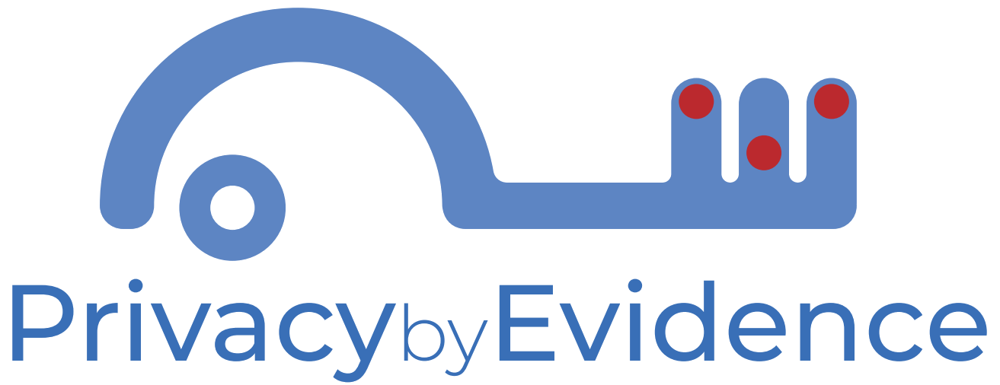

  

# Welcome

This site is under construction.

We propose <em>Privacy by Evidence</em> (<em>PbE</em>): a novel methodology that guides the implementation of privacy concepts in applications. This methodology includes risk assessment, mitigations and tests as crucial activities of the development cycle. Given the general impossibility in providing total privacy (<em>i.e.</em>, free of vulnerabilities), we propose to document the mitigations in form of evidences, aiming to increase the confidence. To document the argumentation and evidences, we use the <em>Goal Structuring Notation</em> (<em>GSN</em>). The effectiveness of <em>PbE</em> was validated through the development of four case studies.

- [Case Study I: Smart Metering](https://pedroysb.github.io/Privacy-by-Evidence/pbe.pdf#page=45)
- [Case Study II: Pulso Application](https://pedroysb.github.io/Privacy-by-Evidence/pbe.pdf#page=82)
- [Case Study III: Lumen Application](https://pedroysb.github.io/Privacy-by-Evidence/pbe.pdf#page=95)
- [Case Study IV: Two Factor Authentication System](https://pedroysb.github.io/Privacy-by-Evidence/pbe.pdf#page=110)

# Support or Contact

Questions about Privacy by Evidence? Contact the authors [mailto](mailto:pedroyossis@copin.ufcg.edu.br,andrey@computacao.ufcg.edu.br,hyggo@computacao.ufcg.edu.br).
