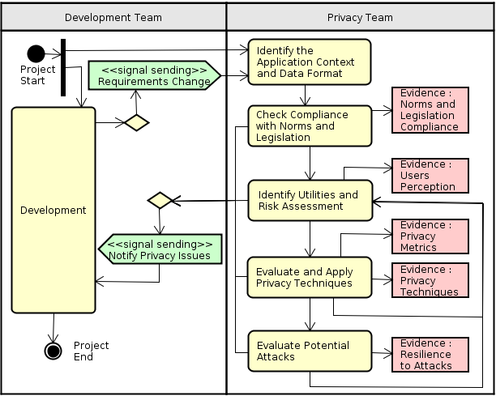
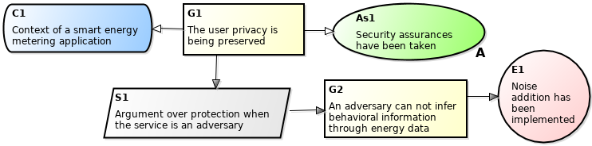

[Back to index](https://pedroysb.github.io/Privacy-by-Evidence)

# Privacy by Evidence

According to the first and third principles of <em>PbD</em> (Cavoukian 2009), the team must act in a preventive manner (not waiting for the violations to happen), and the analysis and risk mitigations must be embedded into the design of the project. For this reason, our methodology consists in the inclusion of a few activities conducted by a privacy team in parallel with the normal development cycle. The parallelism of the privacy preserving activities and the common development is important here, since the product owner does not want a long time to market. If the development takes long, it can be harmful for the company (<em>e.g.</em>, competitors may have the same ideia).

<em>Privacy by Evidence</em> (<em>PbE</em>) begins with the identification of the application context and the data formats, then, legislations are studied, providing evidences of privacy protection. After that, a list of data utilities and their potential privacy risks is made. The next activities are to apply privacy protection techniques and evaluate potential attacks. Since we are proposing an iterative methodology, the team can go back and re-execute the previous activities, being in accordance with the normal software evolution cycle. These activities are structured using a <em>UML Activity Diagram</em>, as shown in Figure 4. This section focuses on explaining the workflow to be executed by the privacy team (right part in Figure 4).

Although we use the term “privacy team”, it is important to note that this team does not need to have privacy experts. In fact, our goal is to guide common developers in doing privacy preserving activities. We separate the teams just to avoid biasing. In the next sections, we detail each of these activities.

  

  
  
Figure 4: The activities of <em>Privacy by Evidence</em>, a software development methodology to provide privacy-awareness.

  

<h2 id="identify-the-application-context-and-data-formats">Identify the Application Context and Data Formats</h2>

In different application contexts, the collected data can exist in different formats. Smart meters, people counting, social networks, geolocation systems and medical applications are some examples of contexts. Time series, aggregated values, network traffic, graphs, geographic localizations and table records are some examples of data formats. The identification of the context and the data format is essential, since different utilities can be provided when processing the data. More importantly, different contexts and data formats can be target of different attacks and privacy violations, and therefore, the usage of different privacy protection techniques is required.

Possible artifacts of this activity may include:

<ul>
<li>
<strong>Engagement Report</strong>: Information regarding the application context, goals and scope;
</li>
<li>
<strong>Datasets</strong>: Samples of the data formats. Most of the time, they do not need to be real. They help the privacy team to understand how the user data would appear to other participants and consequently, possible data manipulations.
</li>
</ul>
<h2 id="check-compliance-with-norms-and-legislations">Check Compliance with Norms and Legislations</h2>

Creating norms to restrict usage of sensitive data is one of the preventive methods for privacy protection. Combined with punishing mechanisms (such as reporting violations to authorities) they can help preventing potentially dangerous activities. Many agencies have proposed privacy rules that must be followed. Being in accordance with these rules generates evidences that privacy is being taken into account and implemented in the development. During this activity, a study about existing norms must be made.

It is also valuable to study legislations, principles and guidelines proposed by organizations and governments. This activity precedes others because the team can not proceed to implement something that is not allowed by the norms and legislations.

Norms and legislations depend on the regions and the companies. For example, in Brazil, the rules for collecting and storing specific sensitive data could be very different from the rules in United States of America (actually, between different states of USA, these could be different too). Also, a company that develops software such as the Hewlett Packard (HP) may have internal privacy norms different from Sony.

Possible artifacts of this activity may include:

<ul>
<li>
<strong>Summary of Norms</strong>: For different regions and companies, it may be the case of having different norms and legislations;
</li>
<li>
<strong>Implementation of Norms</strong>: Code parts of norm implementations and unit tests. For example, using information flow annotations in Java (Myers and Liskov 2000), it is possible to perform static checking on the fields specified by the <em>Safe Harbor</em> standard, presented in Section [sec:norms];
</li>
<li>
<strong>Compliance Proofs</strong>: They are evidences of privacy. For example, certifications are compliance proofs ensuring that the privacy practices meet the constraints defined by the regulatory agencies.
</li>
</ul>
<h2 id="identify-utilities-and-risk-assessment">Identify Utilities and Risk Assessment</h2>

After the identification of the context and the data format, the team should try to list all the potential utilities available after data processing (we consider as utilities everything that the data can be used for, including possible privacy violation activities). Once the team has a list of data utilities, it analyzes and classifies them in a risk level scale, which varies according to the sensitivity of the available data and the adversary model. For instance, low, medium or high level of privacy risk is a possible scale.

For a better classification of the privacy risks, we suggest the conduction of privacy perception studies, where questionnaires and interviews are executed and the answers of the target users are evaluated. These studies may help to understand the sensitivity of the data, to define the adversary model and to elaborate the privacy policy document. Conducting such perception studies and being in accordance with the concerns of the users are in accordance with the seventh principle of <em>PbD</em> and also generate evidences of privacy (perhaps, the most important ones).

Maybe for better perception studies, the privacy team wants to question users regarding the real intended system. However, in a first iteration of our methodology, we do not recommend to collect and use real user data. If serious privacy concerns are detected during the first iteration, this can already cause serious damages. Thus, we only suggest the use of real data in a second iteration, where a privacy policy document has already been presented to the user, and privacy techniques and possible attacks have already been evaluated.

Possible artifacts of this activity may include:

<ul>
<li>
<strong>Utilities List</strong>: For what the data can be used for, including legitimate and bad purposes. A utility has a sensitivity level, according to a defined scale;
</li>
<li>
<strong>Perception Questionnaires</strong>: Set of questions designed to gain knowledge about users’ perceptions of the system;
</li>
<li>
<strong>Perception Report</strong>: To consider the users’ perception in the design of the system is also an evidence of privacy. This report may include statistics, and general privacy recommendations for the system design;
</li>
<li>
<strong>Privacy Concerns</strong>: Identified threats, based on the perception report, the developers experience, or evaluations;
</li>
<li>
<strong>Adversary Model</strong>: Defines the possible adversaries, such as other users, remote services and third parties. It helps to understand the scope of the privacy mitigations;
</li>
<li>
<strong>Privacy Policy</strong>: A document that fulfills a legal requirement to protect the user privacy.
</li>
</ul>
<h2 id="evaluate-and-apply-privacy-techniques">Evaluate and Apply Privacy Techniques</h2>

Despite the existence and implementation of privacy norms, in fact, privacy protection is not achieved yet and for this reason, sometimes it is necessary to apply privacy techniques. Anonymization (Dalenius 1986), generalization (Sweeney 2002), noise addition (Barbosa et al. 2014), and use of homomorphic encryption (Lauter, Naehrig, and Vaikuntanathan 2011) are examples of possible privacy techniques. In [ap:techniques] we present a catalog of privacy techniques that may be useful in helping developers in choosing suited ones. The catalog was created based on the experience of the authors. We do not consider technologies for the security of a system, for example firewalls, intrusion detection systems, etc., but our focus to the techniques which directly act upon the information content.

Several techniques may work for the same context and data format. Therefore, through evaluation of performance metrics such as computational time, cost, application complexity, accuracy, scalability and fault tolerance, and through evaluation of metrics of formal privacy models such as <em>k</em>-anonymity (Sweeney 2002), <em>l</em>-diversity (Machanavajjhala et al. 2007) and <em>ϵ</em>-differential privacy (Dwork 2006), it is decided the privacy techniques to be applied. The application of privacy techniques and evaluation through privacy metrics also generate evidences.

The privacy techniques are also chosen based on the recommendations generated by the privacy perception study and in order to optimize the utilities list, created in the previous activity. The team may choose the techniques that provide the greatest possible amount of utilities that poses no threats and which inhibit the greatest possible amount of utilities that represent threats to users privacy.

The extraction of privacy goals from the privacy policy document may also help in choosing the privacy techniques. Bhatia <em>et al.</em> (Bhatia, Breaux, and Schaub 2016) introduce a semiautomated framework that uses a hybrid combination of crowdsourcing and natural language processing to improve the extraction of privacy goals.

The application of a privacy technique can be considered a software feature and therefore, code parts with the implementation may be generated. Unit tests can also be generated and attached into a continous integration platform, thus, being verified automatically in different stages of the software lifecycle.

Possible artifacts of this activity may include:

<ul>
<li>
<strong>Summary of Techniques</strong>: A catalog, with privacy techniques that can be applied, considering the risk assessment executed in the previous activity;
</li>
<li>
<strong>Techniques Report</strong>: Includes a comparison between the possible privacy techniques. Besides the privacy models, the team may also consider other metrics, such as cost, complexity and accuracy. The choice of good privacy techniques and the achievement of high privacy levels are also evidences of privacy;
</li>
<li>
<strong>Implementation of Techniques</strong>: Code parts with implementation of the privacy techniques and the corresponding tests.
</li>
<li>
<strong>New Utilities List</strong>: With the chosen privacy techniques, it is desirable to provide utilities that poses no privacy threats and to inhibit the utilities that represent threats;
</li>
</ul>
<h2 id="evaluate-potential-attacks">Evaluate Potential Attacks</h2>

After the application of privacy techniques, the team must assure that the unwanted utilities were in fact inhibited. For this reason, it simulates attacks, seeking to explore additional privacy breaches and still search for unwanted utilities. Each unsuccessful attack serves as an evidence that the privacy techniques were implemented in an effective manner and that the data is protected against that kind of attack. In the event of a successful attack, the team must execute the risk assessment again and then improve the techniques or seek for others that better address the detected vulnerabilities.

The simulation of attacks is considered as a software testing activity and can generate scripts that could be integrated with the tests of the software and a continous integration platform, thus, being verified automatically in different stages of the software lifecycle.

Possible artifacts of this activity may include:

<ul>
<li>
<strong>Summary of Attacks</strong>: A catalog, with the potential attacks. Includes the attack plannings and their hypotheses;
</li>
<li>
<strong>Attack Scripts</strong>: The scripts of the attacks to be performed;
</li>
<li>
<strong>Attacks Report</strong>: May include experimental and analytical results of the performed attacks as well as recommendations on how to fix identified flaws. Each unsuccessful attack is an evidence of privacy.
</li>
</ul>
<h2 id="documentation">Documentation</h2>

Table 2 shows a framework for the checklist with the possible artifacts to be generated in each activity of the methodology. A goal of the privacy team may be to supply these artifacts and fill the <em>Supplied?</em> column with check marks (&#9989;).

<table>
  <caption>Table 2: Framework for the checklist of the artifacts to be produced by <em>PbE</em>.</caption>
  <tr>
    <td align="center" style='font-weight:bold;'>Activity</td>
    <td align="center" style='font-weight:bold;'>Artifact</td>
    <td align="center" style='font-weight:bold;'>Supplied?</td>
  </tr>
  <tr>
    <td rowspan="2">Identify the Application Context and Data Formats</td>
    <td>Engagement Report</td>
    <td></td>
  </tr>
  <tr>
    <td>Datasets</td>
    <td></td>
  </tr>
  <tr>
    <td rowspan="3">Check Compliance with Norms and Legislations</td>
    <td>Summary of Norms</td>
    <td></td>
  </tr>
  <tr>
    <td>Implementation of Norms</td>
    <td></td>
  </tr>
  <tr>
    <td>Compliance Proofs</td>
    <td></td>
  </tr>
  <tr>
    <td rowspan="6">Identify Utilities and Risk Assessment</td>
    <td>Utilities List</td>
    <td></td>
  </tr>
  <tr>
    <td>Perception Questionnaires</td>
    <td></td>
  </tr>
  <tr>
    <td>Perception Report</td>
    <td></td>
  </tr>
  <tr>
    <td>Privacy Concerns</td>
    <td></td>
  </tr>
  <tr>
    <td>Adversary Model</td>
    <td></td>
  </tr>
  <tr>
    <td>Privacy Policy</td>
    <td></td>
  </tr>
  <tr>
    <td rowspan="4">Evaluate and Apply Privacy Techniques</td>
    <td>Summary of Techniques</td>
    <td ></td>
  </tr>
  <tr>
    <td>Techniques Report</td>
    <td></td>
  </tr>
  <tr>
    <td>Implementation of Techniques</td>
    <td></td>
  </tr>
  <tr>
    <td>New Utilities List</td>
    <td></td>
  </tr>
  <tr>
    <td rowspan="3">Evaluate Potential Attacks</td>
    <td>Summary of Attacks</td>
    <td></td>
  </tr>
  <tr>
    <td>Attack Scripts</td>
    <td></td>
  </tr>
  <tr>
    <td>Attacks Report</td>
    <td></td>
  </tr>
</table>

During the development process, the satisfability of privacy requirements and the generation of evidences and artifacts may be coupled into <em>User Stories</em>, as well as the definition of <em>Acceptance Criterias</em>.

Even taking privacy aspects into consideration and with many collected evidences, one can never state that a system is completely safe. New vulnerabilities can always be found and yet, real attackers can explore breaches that were not detected by the privacy team. For this reason, there is a need to a constant and iterative process, to analyze new risks and consequently inhibit them. To represent this need, the artifacts should include the review history and dates.

<h3 id="privacy-case">Privacy Case</h3>

The concept of the “safety case” has been adopted across many industries (Kelly and Weaver 2004). Based on the results found in the safety literature, we define the term “privacy case” and apply some of the recommendations in our development process. We define the purpose of a privacy case in the following terms:

A privacy case communicates a clear, comprehensive and defensible argument that a system preserves the users privacy when operating in a particular context.

Both argument and evidence are crucial elements of the privacy case that must go hand-in-hand. An argument without supporting evidence is unfounded, and therefore unconvincing. Evidence without an argument is unexplained - it can be unclear that (or how) privacy goals have been satisfied. To provide an evidence of privacy, the team should make the most appropriate decision by using the most accurate information together with its knowledge, experience and evaluations. Therefore, we define “evidence of privacy” in the following terms:

An envidence of privacy is a best-effort documentation, indicating an effective privacy decision-making and an argument confirmation.

Despite the focus in privacy cases, we must pay attention to the fact that the security of the system is also vitally important, as described in the fifth principle of <em>PbD</em>. A system with security vulnerabilities transitively compromises the data privacy and if an attacker seizes control of the system, the privacy will be at risk. To address these concerns, in parallel to our privacy-awareness methodology, we suggest the inclusion of practices used in security assurance methodologies, such as the evaluation of penetration testing to detect vulnerabilities in the involved elements.

<h3 id="gsn">GSN</h3>

For the privacy case, we consider the evidences of privacy as essential and we propose that when collected, such evidences should be structured using the <em>Structured Assurance Case Metamodel</em> (<em>SACM</em>) (<em>Structured Assurance Case Metamodel (SACM)</em> 2015). <em>Goal Structuring Notation</em> (<em>GSN</em>) (<em>Goal Structuring Notation (GSN)</em> 2011) is an extension of <em>SACM</em> and provides graphical argumentation notation that can be used to document explicitly the individual elements of any argument (claims, evidence and contextual information) and the relationships that exist between these elements (<em>i.e.</em>, how claims are supported by other claims, and ultimately by evidence, and the context that is defined for the argument). Arguments documented using <em>GSN</em> can help provide assurance of critical properties of systems, services and organizations. Within Europe, <em>GSN</em> has been adopted by a growing number of companies within safety-critical industries (such as aerospace, railways and defence) for the presentation of safety arguments within safety cases (Kelly and Weaver 2004). In this work, we reuse these concepts to what we defined as privacy cases.

When the elements of the <em>GSN</em> are linked together in a network, they are described as a “goal structure”. The principal purpose of any goal structure is to show how goals (claims about the system) are successively broken down into sub-goals until a point is reached where claims can be supported by direct reference to available evidence. As part of this decomposition, using the <em>GSN</em> is also possible to make clear the argument strategies adopted, the rationale for the approach and the context in which goals are stated (<em>e.g.</em>, the system scope or the assumed operational role).

The principal symbols of the notation are shown in Figure 5 (with example instances of each concept). In this structure, as in most, there exist “top level” goals – statements that the goal structure is designed to support. In this case, “<em>The user privacy is being preserved</em>”, is the (singular) top level goal. Beneath the top level goal or goals, the structure is broken down into sub-goals, either directly or, as in this case, indirectly through a strategy. The argument strategy that addresses the top level goal is “<em>Argument about protection when the service is an adversary</em>”. This strategy is then substantiated by a sub-goal. At some stage in a goal structure, a goal statement is put forward that need not be broken down and can be clearly supported by reference to some evidence. In this case, the goal “<em>An adversary can not infer behavioral information through energy data</em>”, is supported by direct reference to the evidence “<em>Noise Addition has been implemented</em>”.

  

Figure 5: An example goal structure.

  

Table 3 describes a sheet for the evidence <em>E</em>1, making it easier for the participants of the project to relate it to the corresponding privacy goals and concerns. Every evidence has an identification and a reference to the <em>PbE</em> activity that generated such evidence, enabling the traceability into the corresponding artifacts and the possibility to provide visibility and transparency, according to the sixth principle of <em>PbD</em>. The description of an evidence provides information for how the evidence fulfills its driving goals. It may also contain links with more details regarding the provided evidence, status, review date, and an evidence weight. Some evidences may be more valuable than others and therefore, we encourage teams to choose the weight using a voting system similar to Scrum poker (Molokken-Ostvold, Haugen, and Benestad 2008).

<table>
  <caption>Table 3: Sheet for the evidence <em>E</em>1. Implementation of the privacy technique of noise addition.</caption>
  <tr>
    <td colspan="2" align="left" style='font-weight:bold;'>E1</td>
    <td colspan="2" align="left" style='font-weight:bold;'>Noise addition has been implemented</td>
    <td colspan="2" align="left" style='font-weight:bold;'>Status:</td>
    <td colspan="2" align="left" style='font-weight:bold;'>Review Date:</td>
    <td colspan="2" align="left" style='font-weight:bold;'>Weight:</td>
  </tr>
  <tr>
    <td colspan="2" align="left"></td>
    <td colspan="2" align="left"></td>
    <td colspan="2" align="left">Done</td>
    <td colspan="2" align="left">February 2015</td>
    <td colspan="2" align="left">8</td>
  </tr>
  <tr>
    <td><i>PbE Activity</i>: Evaluate and Apply Privacy Techniques</td>
  </tr>
  <tr>
    <td><i>Driven by</i>: G1 → S1 → G2; <i>In context of</i>: C1; <i>Assumptions</i>: As1</td>
  </tr>
  <tr>
    <td><u>Description</u>: A noise addition privacy-preserving scheme for smart metering has been implemented. We claim that the solution meets the needs of consumers (privacy) and power providers (utility). The modification in the communication procedure between a smart meter and the power provider is just the generation of a random number and the addition of this number to the measurement to be sent to the power provider.</td>
  </tr>
    <tr>
    <td><u>References</u>: [Case Study I](https://pedroysb.github.io/Privacy-by-Evidence/case1)</td>
  </tr>
</table>
